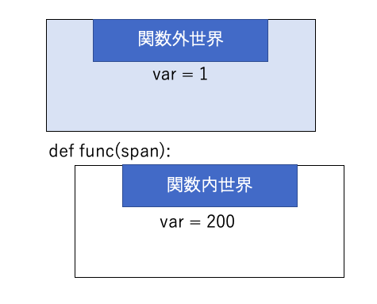

06 関数の応用
============

* Pythonの組み込み関数の中には、引数が追加できるものがあった

  => 例)`int()`：文字列を数値に変換する関数

    * 数値に変換したい文字列を引数として渡す

    * その後に整数の数値を渡すことができる

    ```python
    >>> int("101010", 2) # 2進数相当の文字列を数値に変換
    42
    ```

    * 関数に渡す引数を省略できる

    ```python
    >>> int("101010")
    101010
    ```

    * この場合は、2番目の引数を省略して関数を呼び出しているので、文字列を10進数とみなして、整数に変換する

* このように、特に指定しない時に暗黙に指定される引数のことを、`デフォルト引数`と呼ぶ

* また、省略時に引数に渡される値を、`デフォルト値`と呼ぶ


## 関数にデフォルト引数を定義する

* Pythonでは、自分で作った関数にデフォルト引数を定義することができる

* デフォルト引数を定義するには、関数を定義する時にイコール`=`に続けて値を書き込む

  => 引数に値を代入するイメージ

```python
def 関数名(引数1=デフォルト値, 引数2=デフォルト値):
  関数のブロック
```

* デフォルト値を持つ引数の後に、デフォルト値を持たない引数を定義することはできない

  => デフォルト引数は、引数リストの後ろの方にまとめる

```python
def fizzbuzz(count=100, fizzmod=3, buzzmod=5):
  for cnt in range(1, count+1):
    if cnt%fizzmod == 0 and cnt%buzzmod == 0:
      print("FizzBuzz")
    elif cnt%fizzmod == 0:
      print("Fizz")
    elif cnt%buzzmod == 0:
      print("Buzz")
    else:
      print(cnt)

# 実行結果
>>> fizzbuzz(5)
1
2
Fizz
4
Buzz
```


## 引数のキーワード指定

* 関数を定義する時、引数はカンマ`,`で区切って複数指定できる

* この順番は、関数を呼び出す時に、この順番通りに引数が渡される

* 例)以下のコードはエラーとなる

  => 文字列が期待されている場所に数値が代入されているため

```python
>>> int(2, "1010")
Traceback (most recent call last):
  File "<stdin>", line 1, in <module>
TypeError: 'str' object cannot be interpreted as an integer
```

* あえて順番を入れ替えて呼び出す方法がある

  * 関数に引数を渡す時に、引数の名前を明示する

  * `int()`関数の場合は、第一引数が`x`、第二引数が`base`なので、以下のように打ち込むことで実行できる

  ```python
  >>> int(base=2, x="1010")
  10
  ```

  * 引数名を指定して引数を渡すことを、`引数のキーワード指定`と呼ぶ

* `引数のキーワード指定`は、デフォルト引数がいくつか定義されている関数があり、1つだけデフォルト値以外の引数を指定したいときなどに使う

* なお、キーワード指定した引数の後ろに、キーワード指定しない引数を渡すことはできない


## 関数とローカル変数

* 関数内部で定義された変数や引数は、`ローカル変数`として振る舞う

  => 以降、詳しく説明する

* Pythonの関数で変数を使うとき、関数の外で定義した変数を、関数内部で書き換えようとすると、うまくいかなくなる

* 例)引数を1つだけ持つ関数を定義し、引数を関数の外側で定義した変数(local_var)に代入する

```python
>>> local_var = 1
>>> def test_func(an_arg):
...   local_var = an_arg
...   print("test_func()の中＝", local_var)
...

# 実行
>>> test_func(200)
test_func()の中＝ 200
>>> print("test_func()の外＝", local_var)
test_func()の外＝ 1
```

* このコードを実行してみると、

  * 関数の中で呼び出されている場合は、local_varに引数の200が代入されている

  * test_func()を呼び出した後にlocal_varを表示してみると、コードの最初に代入した値(1)に戻っている

* Pythonでは、代入が変数定義、関数の中と外では別の世界となっている

  => 関数ブロックの1行目で、local_varと言う同じ名前の新しいローカル変数が定義されている

  => 関数の外と内で別れていることで、変数の混合を防ぐことができる



* Pythonでローカル変数が定義されるのは、基本的に関数の中だけ

* 関数の外から関数内世界を覗くことはできないが、関数内から関数の外を覗くことはできる

* 関数の処理に必要なデータは引数として渡して、結果を戻り値として返すようにすると、良い関数ができる


| 版 |  年月日   |
|---|----------|
|初版|2019/01/13|
