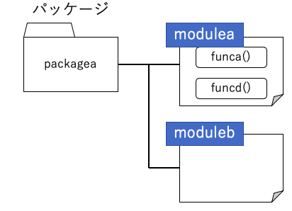

02 モジュールの階層構造(パッケージ)
==============================

* Pythonには、複数のモジュールを束ねて管理する`パッケージ`という仕組みが備わっている

  * モジュールが行う処理の種類によってモジュールをさらに分類し、パッケージとしてまとめると便利

  * Djangoやnumpyなどの大規模なフレームワークやライブラリでは、このパッケージという仕組みを使ってモジュールを管理している


## パッケージの実態

* パッケージを使うと、複数のモジュールを1つのパッケージの配下に納めることができる

* パッケージの実体は、`モジュールとなるファイルを納めたディレクトリ(またはファイル)`

* パッケージは、階層構造を生み出す

* Pythonでは、階層構造をドット`.`で区切る



* このような構成のパッケージがあった場合、「`modulea`」をインポートするには以下のように記述する

```python
import packagea.modulea
```

* `modulea`に定義されている関数`funca()`を実行するには、以下のように記述する

  => パッケージ名、モジュール名は省略できない

```python
import packagea.modulea

packagea.modulea.funca()
```

* from文を用いると、間の階層を飛び越してモジュールを読み込み、定義する

```python
from packagea import modulea

modulea.funca()
```


## パッケージを作る

* Pythonのパッケージの実体は、`ディレクトリ(またはフォルダ)`だが、全てのディレクトリがパッケージとしててインポートの対象になるわけではない

* パッケージとして使いたいディレクトリには`__init__.py`という名前のファイルを設置する

  * パッケージをインポートすると、このファイルがまず読み込まれ、トップレベルのブロックが実行される

  * トップレベルのブロックには、パッケージをインポートする時に実行したい初期化用のコードを書くことができる

    => ファイルを空にしても問題ない


| 版 |  年月日   |
|---|----------|
|初版|2019/02/02|
