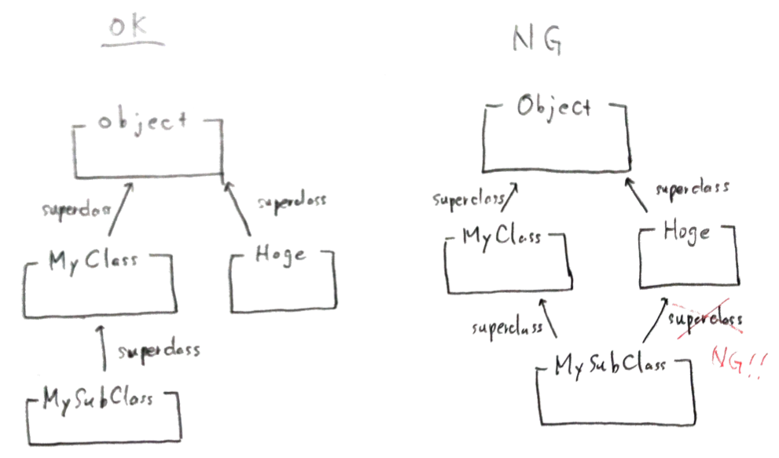
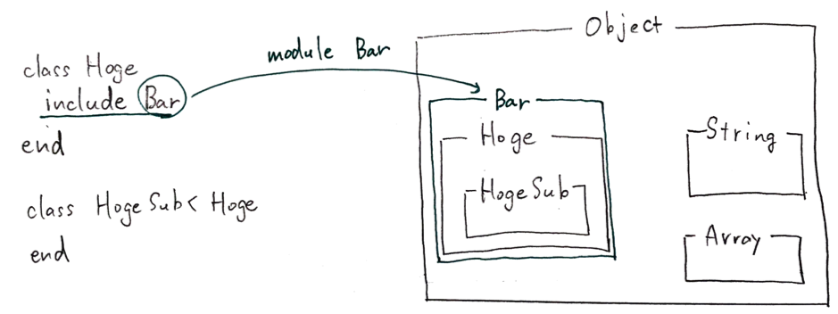
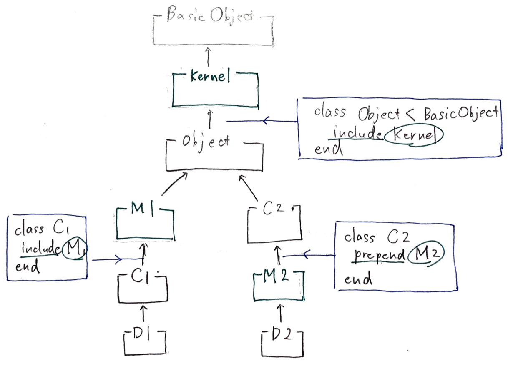

03 Mix-in
=========

## 目次

* [Mix-inとは](#0Mix-inとは)

* [モジュールの定義とインクルード](#1モジュールの定義とインクルード)

* [モジュールのメソッドの探索経路](#2モジュールのメソッドの探索経路)


### 0.Mix-inとは

* Rubyで多重継承を実現する機能

* モジュールに定義されたメソッドは、クラスのインスタンスメソッドとして取り込むことができる


## 1.モジュールの定義とインクルード

### `class`を使った多重継承ができない由来

* Rubyの継承は、単一継承のみを許しており、同時に複数のスーパークラスを持つ多重継承を許していない

* `class`式で指定できるスーパークラスは、必ず１つ




### Mix-in

* クラスに機能を混ぜ合わせることで、複数のクラスの機能を共有する

* 複数のクラスで適用したい機能は、 **モジュール** というオブジェクトで定義する

*  **モジュール** をクラスに取り込むことで、機能を拡張する




### モジュールの特徴

#### クラスとの違い

* インスタンスを生成できない

* 継承できない

#### モジュールの用途

* 名前空間を作る

* モジュールのメソッドをあるクラスのインスタンスメソッドとして取り組む

* モジュールのメソッドをあるオブジェクトの特異メソッド(クラスメソッド)として取り組む

* 特異メソッドやモジュール関数を定義して使う


### モジュールの例

```ruby
>> module Bar
>>   def methodA
>>     @a
>>   end
>> end
=> :methodA

# モジュールオブジェクトの操作
>> p Bar.ancestors
[Bar]
=> [Bar]
>> p Bar.instance_methods
[:methodA]
=> [:methodA]
>> p Bar.new
NoMethodError: undefined method 'new' for Bar:Module
```


## 2.モジュールのメソッドの探索経路

### インクルードしたクラスの継承チェーン

* 継承チェーンには、モジュールも含まれる

* 継承チェーンに挿入するには、

  * `include`：モジュールをクラスにインクルードする。インクルードするクラスの真上の継承チェーンに挿入する

  * `prepend`：`include`と同様。インクルードするクラスの真下の継承チェーンに挿入する

* `include`を実行すると、指定されたモジュールに対応する無名クラスを作成して、スーパークラスとの間に組み入れられる

  * この無名クラスは、インタプリタの実装の都合上作られるもので、ユーザーに意識させたくないので`superclass`で参照できないようになっている

```ruby
# include
>> module M1
>>   def my_method
>>     'M1#my_method()'
>>   end
>> end
=> :my_method
>>
?> class C1
>>   include M1
>> end
=> C1
>>
?> class D1 < C1
>> end
=> nil
>> D1.ancestors
=> [D1, C1, M1, Object, Kernel, BasicObject]


# prepend
>> module M2
>>   def my_method
>>     'M2#my_method()'
>>   end
>> end
=> :my_method
>>
?> class C2
>>   prepend M2
>> end
=> C2
>>
?> class D2 < C2
>> end
=> nil
>> D2.ancestors
=> [D2, M2, C2, Object, Kernel, BasicObject]
```



### 多重インクルード

* モジュールがすでに継承チェーンに存在していたら、2回目の挿入を無視する

* モジュールは継承チェーンの中で一度だけ登場する

```ruby
>> module M1; end
=> nil

?> module M2
>>   include M1
>> end
=> M2

?> module M3
>>   prepend M1
>>   include M2
>> end
=> M3

>> M3.ancestors
=> [M1, M3, M2]

>> M2.ancestors
=> [M2, M1]
```


### 複数インクルード

* モジュールをインクルードしてできた無名クラスは、実行したクラスの親に順に挿入される

```ruby
>> module Bar; end
=> nil
>> module Bar2; end
=> nil

?> class Foo; end
=> nil

?> class FooExt < Foo
>>   include Bar
>>   include Bar2
>> end
=> FooExt

>> FooExt.ancestors
=> [FooExt, Bar2, Bar, Foo, Object, Kernel, BasicObject]
```


### メソッドの優先度

* モジュールと同名のメソッドを`include`メソッドの実行前に定義した場合、継承チェーンに挿入されるだけ

  > 実行順序に関わらず、常に **そのクラス中のメソッド定義が優先される**

* モジュールに対応した無名クラスが、スーパークラスとの間の継承チェーンに挿入されるだけ

```ruby
>> module M1
>>   def method1; 1; end
>> end
=> :method1

?> class C1
>>   def method1; 2; end
>>   include M1
>> end
=> C1

>> p C1.new.method1   # C1クラスのmethod1が実行されている
2
=> 2
```


| 版     | 年/月/日   |
| ------ | ---------- |
| 初版   | 2018/10/06 |
| 第二版 | 2019/05/13 |
