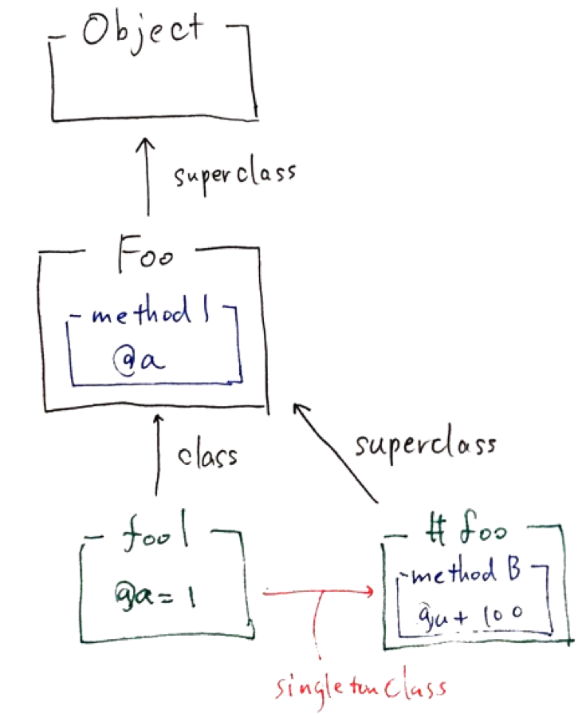
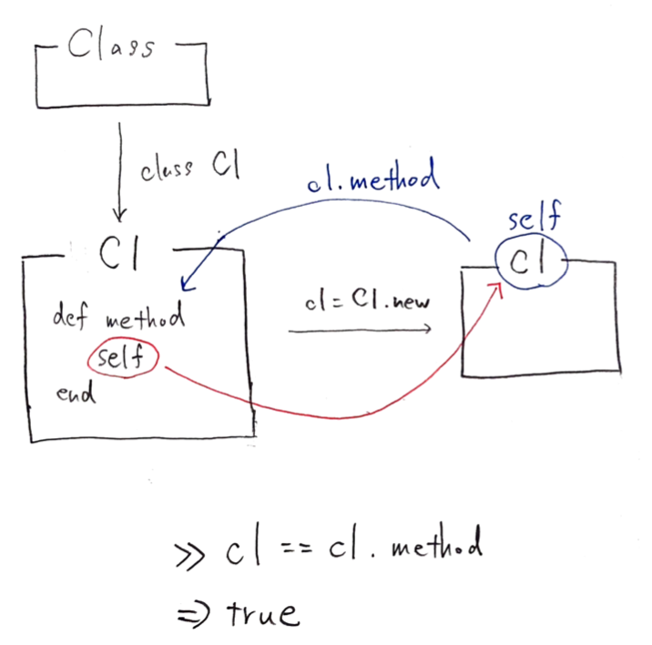
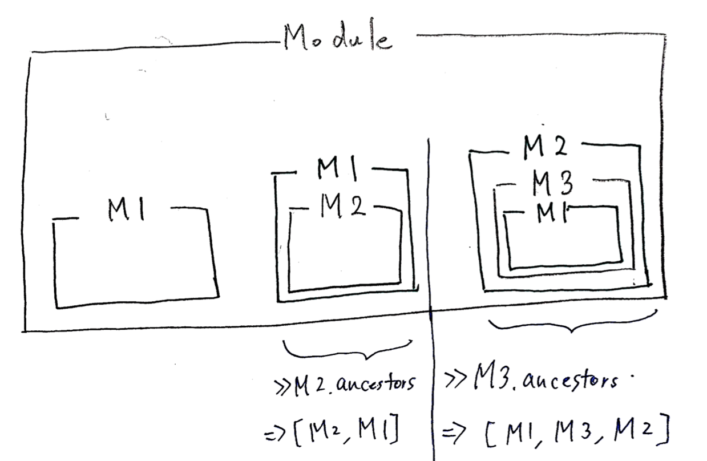

04 特異クラス
============

## 目次

* [特異クラスとは](#0特異クラスとは)

* [特異クラスの性質](#1特異クラスの性質)

* [特異クラスの参照と定義](#2特異クラスの参照と定義)

* [extendメソッド](#3extendメソッド)

* [prependメソッド](#4prependメソッド)

* [Refinements](#5Refinements)


## 0.特異クラスとは

* 指定したインスタンスにだけ適用される特別なクラス

* 別名は、 **シングルトンクラス(Singleton Class)**

* 無名クラスとは異なる。 **特異クラス**


## 1.特異クラスの性質

* プログラムを書いているときに、特定のインスタンスに特別な性質を持たせたい場面が登場する。

  * この時に、継承したクラスを書いて、新たにインスタンス化することで実現はできるが、いちいちサブクラスを書くのは面倒

  * この時、Rubyでは **インスタンスに直接メソッドを定義することができる**

* このメソッドを、 **特異メソッド** という

```ruby
def <オブジェクト名>.<新たに定義するメソッド名>
  # 内容
end
```

* `Foo`クラスから生成した`foo1`オブジェクトに、`methodB`という新たなメソッドを追加する場合は、以下のように記述できる

```ruby
>> class Foo
>>   def initialize(a)
>>     @a = a
>>   end
>>   def method1
>>     @a
>>   end
>> end
=> :method1

>> foo1 = Foo.new(1)
=> #<Foo:0x007f868e0fa778 @a=1>
>> def foo1.methodB
>>   @a + 100
>> end
=> :methodB

>> p foo1.methodB
101
=> 101
>> foo2 = Foo.new(1)
=> #<Foo:0x007f868e0e3118 @a=1>
>> p foo2.methodB
NoMethodError: undefined method 'methodB' for #<Foo:0x007f868e0e3118 @a=1>
```

### コードを読み解く

* Rubyインタプリタは、特異クラスと呼ばれるクラスを作成して継承チェーンに組み入れる

* 特異クラスに対応するオブジェクトは、指定されたインスタンスの生成元をスーパークラスとして指す

* 特異クラスが生成された後も、インスタンスは依然として元の生成元をクラスとして指す

* 特異クラスは、無名クラスと同様にインタプリタの中で使用するクラスなので、継承チェーンに直接現れない




## 2.特異クラスの参照と定義

### 特異クラスの取得

* 特異クラスは、ユーザに意識させたくないものだが、以下の定義式で呼び出すことができる

```ruby
# 定義式
class << 対象のオブジェクト
end

# 実際の例
>> foo1 = Foo.new(1)
=> #<Foo:0x007f868f0db6b0 @a=1>
>> singleton_class = class << foo1
>>                     self
>>                   end
=> #<Class:#<Foo:0x007f868f0db6b0>>
>> p singleton_class
#<Class:#<Foo:0x007f868f0db6b0>>
=> #<Class:#<Foo:0x007f868f0db6b0>>
```

* 特異クラス定義の中で、メソッドを定義することができる

```ruby
>> foo1 = Foo.new(1)
=> #<Foo:0x007f868e0c16f8 @a=1>
>> class << foo1
>>   def methodC; @a + 200; end
>> end
=> :methodC

>> p foo1.methodC
201
=> 201
```


### `self`の参照先

* Rubyのコードは、オブジェクト(カレントオブジェクト)の内部で実行される。このオブジェクトを、`self`と呼ぶ

* `self`の役割を担えるオブジェクトは同時に複数は存在しない

* メソッドのレシーバが`self`になったら、全てのインスタンス変数は`self`のインスタンス変数になる。

  * レシーバを明示しないメソッド呼び出しは全て`self`に対しての呼び出しになる

* 他オブジェクトを明示してメソッドを呼び出すと、今度はそのオブジェクトが`self`になる

```ruby
>> class MyClass
>>   def testing_self
>>     @var = 10        # selfのインスタンス変数
>>     my_method        # `self.my_method`と同じ
>>     self
>>   end
>>   def my_method
>>     @var = @var + 1
>>   end
>> end
=> :my_method

>> obj = MyClass.new
=> #<MyClass:0x007fb18c0c3088>
>> obj.testing_self
=> #<MyClass:0x007fb18c0c3088 @var=11>
```


### トップレベル

* メソッドを呼び出さない場合のオブジェクトの`self`は、`main`と呼ばれるオブジェクトの内部にいることになる

  * このオブジェクトを`トップレベルコンテキスト`という

* トップレベルの意味は、メソッドを呼び出していないとき、あるいは呼び出したメソッドが全て戻ってきた状態のことを言う

```ruby
>> self
=> main
>> self.class
=> Object
```

### クラス定義と`self`

* どこで使われるかで示すオブジェクトが異なる。メソッドのレシーバ(メソッドの受け手)自身を参照する

  * クラス内部で使用されれば、そのクラスを保持する

  * メソッド内部で使用されれば、そのメソッドを実行するオブジェクトを保持する(属しているインスタンスを参照できる)

```ruby
# クラス内部で使用
>> class MyClass
>>   p self
>> end
MyClass
=> MyClass

# メソッド内部で使用
>> class C1
>>   def method1
>>     self
>>   end
>> end
=> :method1

>> c1 = C1.new
=> #<C1:0x007fb96900cc68>
>> p c1 == c1.method1     # レシーバーと同じオブジェクト
true
=> true
```




### `HelloWorld#name=`のメソッド呼び出し

* メソッド呼び出し時の`self`は省略することができない

  * 省略するとローカル変数の代入として解釈される

```ruby
class helloWorld
  attr_accessor :name
  def greet
    puts "Hi, I am #{self.name}"
    puts "Hi, I am #{name}"        # レシーバを省略した呼び出し
  end
  def test_name
    name = "Ruby"                  # 変数nameの定義
    self.name = "Ruby"             # アクセサで定義したnameは、selfを省略できない
  end
end
```

### メソッドがネストした場合

* メソッドは、そのメソッドが定義されたクラスに所属する

* メソッドがネストした場合は、外側のメソッドが定義されたクラスに定義される

* 内側のメソッドは、外側のメソッドが実行されるまでは定義されない

```ruby
>> class C2
>>   def method1         # method1の定義先はC2
>>     def method2       # method2の定義先はmethod1のself(C2)
>>     end
>>   end
>> end
=> :method1

>> C2.instance_methods(false)  # まだmethod2はC2に定義されていない
=> [:method1]
>> C2.new.method1
=> :method2
>> C2.instance_methods(false)  # method1が実行され、method2が定義
=> [:method1, :method2]
```


## 3.extendメソッド

* `Object#extend`：クラス拡張・オブジェクト拡張を行うためだけのメソッド

* `include`では特異クラスを開く必要があるが、その必要がなくなる(特異クラスのMix-inと考える)

* レシーバの特異クラスにモジュールをインクルードするためのショートカット

```ruby
# includeメソッド
>> foo1 = Foo.new(1)
=> #<Foo:0x007f868f04aea8 @a=1>
>> class << foo1
>>   include Bar
>> end
=> #<Class:#<Foo:0x007f868f04aea8>>
>> p foo1.methodA
1
=> 1

# extendメソッド
>> foo1 = Foo.new(1)
=> #<Foo:0x007f868e0a1948 @a=1>
>> foo1.extend(Bar)
=> #<Foo:0x007f868e0a1948 @a=1>
>> p foo1.methodA
1
=> 1
```


## 4.prependメソッド

* 継承チェーンには、モジュールも含まれる

* 継承チェーンに挿入するには、

  * `include`：モジュールをクラスにインクルードする。インクルードするクラスの真上の継承チェーンに挿入する

  * `prepend`：`include`と同様。インクルードするクラスの真下の継承チェーンに挿入する

* `include`を実行すると、指定されたモジュールに対応する無名クラスを作成して、スーパークラスとの間に組み入れられる

  > この無名クラスは、インタプリタの実装の都合上作られるもので、ユーザーに意識させたくないので`superclass`で参照できないようになっている

```ruby
# include
>> module M1
>>   def my_method
>>     'M1#my_method()'
>>   end
>> end
=> :my_method
>>
?> class C1
>>   include M1
>> end
=> C1
>>
?> class D1 < C1
>> end
=> nil
>> D1.ancestors
=> [D1, C1, M1, Object, Kernel, BasicObject]


# prepend
>> module M2
>>   def my_method
>>     'M2#my_method()'
>>   end
>> end
=> :my_method
>>
?> class C2
>>   prepend M2
>> end
=> C2
>>
?> class D2 < C2
>> end
=> nil
>> D2.ancestors
=> [D2, M2, C2, Object, Kernel, BasicObject]
```


### 多重インクルード

* モジュールがすでに継承チェーンに存在していたら、2回目の挿入を無視する

* モジュールは継承チェーンの中で一度だけ登場する

```ruby
>> module M1; end
=> nil

?> module M2
>>   include M1
>> end
=> M2

?> module M3
>>   prepend M1
>>   include M2
>> end
=> M3

>> M3.ancestors
=> [M1, M3, M2]

>> M2.ancestors
=> [M2, M1]
```




## 5.Refinements

* Rubyは既存のクラスに対して、メソッドを任意に変更したり追加することができるが、一度書き換えると全体へ影響を及ぼす

* この問題の解決策として、`Refinements`と言う仕組みができた


### `Refinements`の基本

* `refine`メソッドで変更を加えるクラスを宣言

* `using`メソッドを呼び出した以降から、変更したメソッドの呼び出しが有効になる

```ruby
module StringExtensions
  refine String do
    def to_alphanumeric
      gsub(/[^\w\s]/, '')
    end
  end
end

"my *1st* refinement!".to_alphanumeric
using StringExtensions
"my *1st* refinement!".to_alphanumeric

# 実行結果
NoMethodError: undefined method 'to_alphanumeric' for "my *1st* refinement!":String
"my 1st refinement"  # usingを使用しているので、変更される
```

* モジュールの中でも`using`を呼び出すことができ、モジュールの定義の終わりまで有効

* `refine`ブロックそのもので有効になる

* `using`を呼び出した場所からファイルの終わりまで(トップレベルにいる場合)有効になる

```ruby
>> module StringExtensions
>>   refine String do
?>     def reverse
>>       "esrever"
>>     end
>>   end
>> end
=> #<refinement:String@StringExtensions>

?> module StringStuff
>>   using StringExtensions
>>   "my_string".reverse
>> end
=> "esrever"

?> "my_string".reverse
=> "gnirts_ym"
```


### `Refinements`の問題点

* `using`の呼び出しの後に`my_method`を呼び出すと、refineされたバージョンのメソッドが手に入る

* 一方、`using`の後に`another_method`を呼び出すと、元のrefineされていないバージョンのメソッドが呼び出される

  > メソッド呼び出しの時に、再確認する必要がある

```ruby
class MyClass
  def my_method
    "original my_method"
  end

  def another_method
    my_method
  end
end

module MyClassRefinements
  refine MyClass do
    def my_method
      "refined my_method"
    end
  end
end

using MyClassRefinements
MyClass.new.my_method
MyClass.new.another_method

# 実行結果
"refined my_method"
"original my_method"
```

* 他にも、クラスはモジュールであるにも関わらず、クラスの中では呼び出せない

* `methods`や`ancestors`などのメタプログラミングのメソッドは、`Refinements`を無視する


| 版     | 年/月/日   |
| ------ | ---------- |
| 初版   | 2018/10/13 |
| 第二版 | 2019/05/13 |
