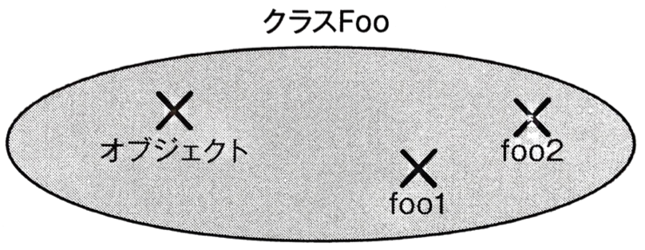
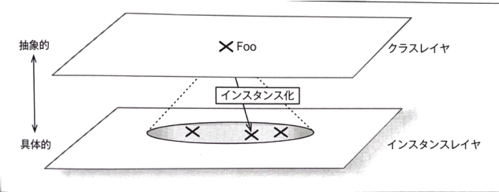
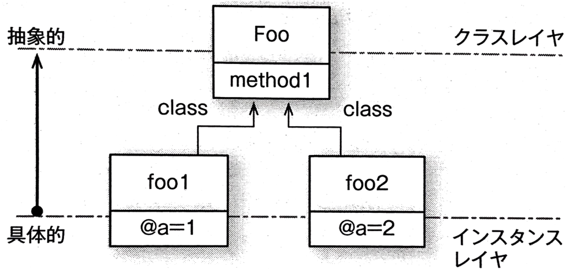
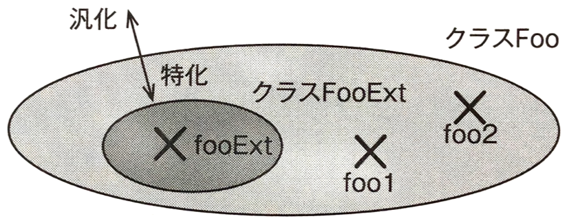
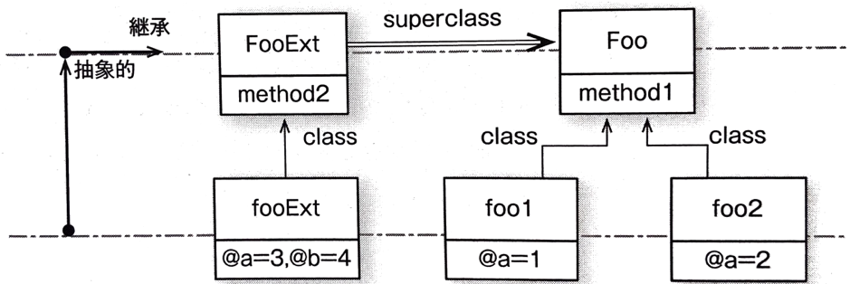
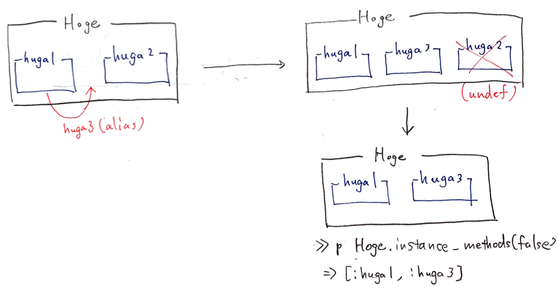

4-2.インスタンスメソッド
====================

### これまでの確認

* インスタンスは、クラスで定義されたインスタンスメソッドを呼び出すことができる

* 継承したクラスのインスタンスは、スーパークラスで定義されたインスタンスメソッドを呼び出すことができる

ここでは、Rubyインタプリタがどのように実行するメソッドを特定しているかを理解することで、

`モジュール`や`特異クラス`の理解を容易にする。

→呼び出されたメソッドが探索される経路を詳細に見てみる

## 4-2-1.クラスオブジェクト

* クラスをグループとして捉えた時、

  * プログラム上でのオブジェクトの **雛形** が`クラス`

  * `クラス`から`オブジェクト`を生成することを、 **インスタンス化** と呼ぶ

  * 例として、HTMLのクラス属性や正規表現の文字クラス



* `Fooクラス`に対応するオブジェクトが生成する

* インスタンスを生成すると、１つ上のクラスレイヤからオブジェクトが生成されてインスタンスレイヤに降ってくる



* メモリ上では、インスタンスメソッドはクラスオブジェクトに保持

* メモリ上では、インスタンス変数はインスタンスに保持

* `classオブジェクト`は、生成元のクラスオブジェクトを返す



***

## 4-2-2.継承したクラスオブジェクト

* クラスをグループとして捉えると、継承したクラスはグループ中の限定されたグループとして表現できる



* `foo1`と`fooExt`は、`Foo`クラスで定義された性質を持つ。さらに、`ext1`は`FooExt`クラスで定義された性質を持つ。

* 外側のグループは、一般的な性質を持つ(汎化)。内側のグループは、固有の性質を持つ(特化)。



***

## 4-2-3.メソッドの探索経路

メソッドを呼び出すと、Rubyは以下の2つのことを行う

1. メソッドを探す。(メソッド探索)

2. メソッドを実行する。(`self`が必要)

### メソッド探索

* レシーバ：呼び出すメソッドが属するオブジェクトのこと

  →例)`my_string.reverse`：`my_string`がレシーバ

* 継承チェーン：Rubyがレシーバのクラスに入り、メソッドを見つけるまで継承チェーンを登ること

```ruby
>> class MyClass
>>   def my_method; 'my_method()'; end
>> end
=> :my_method
>>
?> class MySubclass < MyClass
>> end
=> nil
>>
?> obj = MySubclass.new
=> #<MySubclass:0x007fdabc80d538>
>> obj.my_method()
=> "my_method()"
```


#### 解説

1. インスタンスメソッドを実行すると、インタプリタはそれが属するクラスのクラスオブジェクトに指定されたメソッドが存在するかどうかを判定

2. メソッドが存在しない場合、スーパークラスのクラスオブジェクトを順に辿ってメソッドを探す

3. 最後まで見つからなかった場合は、例外`NoMethodError`を発生する

要するに、 **１つ抽象度を上げて、継承の方向へ辿る**

***

## 4-2-4.継承チェーンと`method_missing`

### クラスの継承チェーンの参照

* クラスオブジェクトに対して`ancestors`メソッドを実行することで、クラスの継承チェーンが配列で表示される

```ruby
>> class Foo; end
=> nil
>> class FooExt < Foo; end
=> nil

>> p Foo.ancestors
[Foo, Object, Kernel, BasicObject]
=> [Foo, Object, Kernel, BasicObject]
>> p FooExt.ancestors
[FooExt, Foo, Object, Kernel, BasicObject]
=> [FooExt, Foo, Object, Kernel, BasicObject]
```

* あるクラスが継承チェーンに含まれているかどうかを判定するには、比較演算子を用いる

```ruby
>> Foo < Object
=> true
>> Foo > Object
=> false
```

### オブジェクトがもつインスタンスメソッド・インスタンス変数の参照

* `instance_methods`：オブジェクトが持つインスタンスメソッドを調べる

* `instance_variables`：オブジェクトが持つインスタンス変数を調べる(`false`を指定することで、スーパークラスを辿らない)

```ruby
Foo.instance_methods(false)
=>[:method1]
FooExt.instance_methods(false)
=>[:method2]
foo1.instance_variables
=>[:@a]
fooExt.instance_variables
=>[:@b, :@a]
```

### 継承チェーンにあるメソッドの変更

#### `alias`式

* メソッドに別名をつける

* メソッドではないので、間にカンマ`,`は指定しない

* メソッド名は識別子かシンボルで指定

```ruby
alias <新メソッド名> <旧メソッド名>
alias <新グローバル変数名> <旧グローバル変数名>
```

#### `undef`式

* 指定されたメソッド定義を消す

* メソッド名は識別子かシンボルで指定

* カンマ`,`で区切って複数のメソッドを指定することができる

* `alias`が定義されているメソッドの場合は、片一方のメソッドを`undef`しても別名で実行できる

```ruby
undef <メソッド名>
undef <メソッド名>,<メソッド名>
```

#### `alias`と`undef`を両方用いた例

```ruby
>> class Hoge
>>   def huga1; end
>>   def huga2; end
>>   alias :huga3 :huga1
>>   undef :huga2
>> end
=> nil

>> p Hoge.instance_methods(false)
[:huga1, :huga3]
=> [:huga1, :huga3]
```




#### `alias`と`alias_method`の違い

どちらも既存のメソッドに対して別名をつけることができるものですが、下記の点が違いがあります。

|                        |alias|alias_method|
|------------------------|-----|------------|
|グローバル変数に別名をつける | 可能 |   不可能   |
| メソッド名に文字列が使える  |不可能|    可能    |
|     キーワードである      | Yes |     No     |
|      メソッドである       |  No |    Yes    |
|    オーバーライドできる    |不可能|    可能    |

これらの違いを考慮して、それぞれ適した使い分けをする必要があります。

alias_methodメソッドで別名を付ける場合、

元のメソッドに対して

  * `remove_method`

  * `undef_method`

を適用することで元にメソッドを呼べないようにすることもできます。

* `alias`式

カンマ`,`が入っていない

```ruby
alias new_method old_method
alias :new_method :old_method
alias $new_global_val $old_global_val
```

* `alias_method`式

カンマ`,`が入っている

```ruby
alias_method "new_method", "old_method"
alias_method :new_method, :old_method
```


### `method_missing`

* メソッドが見つからない場合は、`NoMethodError`が発生する

  →厳密には、`BasicObject`クラスの`method_missing`メソッドが呼び出される

* `method_missing`：デフォルトの実装は、第一引数に指定されたメソッド名、第二引数以降に指定された引数が渡され、例外を発生

* `method_missing`を上書きすることで、メソッドが見つからない場合の動作をフックすることができる

```ruby
>> class Hoge
>>   def method_missing(m, *args)
>>     p "called:" + m.to_s
>>     super                  # 例外が発生するように、スーパークラスの`method_missing`を呼び出す
>>   end
>> end
=> :method_missing

>> Hoge.new.no_method
"called:no_method"
NoMethodError: undefined method `no_method` for #<Hoge:0x007fa3889a1018>
```

* オープンソースのコードを読んでいる時にどこにもメソッドが定義されていない場合は、`method_missing`でフックされているか、動的にメソッドを作っている

***

## 4-2-5.オープンクラス

同名のクラスを複数回定義してもエラーにはならない

class式は **クラスオブジェクトが存在しない場合に生成** する。

既にクラスオブジェクトが存在する場合には、そのオブジェクトをもう一度「開いて」評価する

```ruby
>> class Hoge
>>   def fuga1; end
>> end
=> :fuga1
>>
?> class Hoge
>>   def fuga2; end
>> end
=> :fuga2
>>
?> Hoge.instance_methods(false)
=> [:fuga1, :fuga2]
```

* 最初の`class Hoge`の段階では、まだクラスは存在していない。Rubyがこのクラス(と`fuga1`メソッド)の定義の中に入った時に始めてクラスを定義

* 2回目の`class Hoge`の段階では、既にそのクラスは存在しているので改めてクラスを定義する必要がない

* いつでもクラスを再オープンして、その場で修正できる
  → **オープンクラス**

* 一度定義したクラスを再定義のために開くこと
  → **クラスの再オープン**

### オープンクラスの問題点

組み込みクラスを再オープンするとき、同名のメソッドを上書きするとプログラム全体がバグを起こす

→ **モンキーパッチ**

```ruby
>> class String
>>   def huga; 1; end
>>   def reverse; 2; end
>> end
=> :reverse
>>
?> p "my string".huga
1
=> 1
>> p "my string".reverse   # 上書きされたメソッドで実行されている
2
=> 2
```

スーパークラスを指定して再オープンする場合、スーパークラスはオープンする前のクラスと同じでなければならない

```ruby
>> class Foo; end
=> nil
>> class Bar; end
=> nil
>> class Baz < Foo
>> end
=> nil

>> class Baz < Bar
>> end
TypeError: superclass mismatch for class Baz

>> class Baz < Foo   # OK
>> end
=> nil

>> class Baz         # OK
>> end
=> nil
```

| 版 |  年月日   |
|---|----------|
|初版|2018/10/13|
