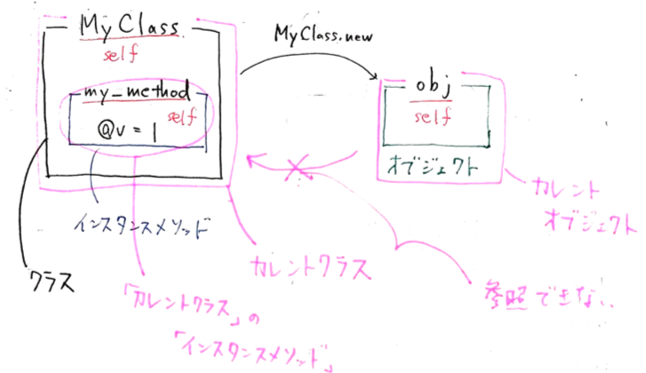
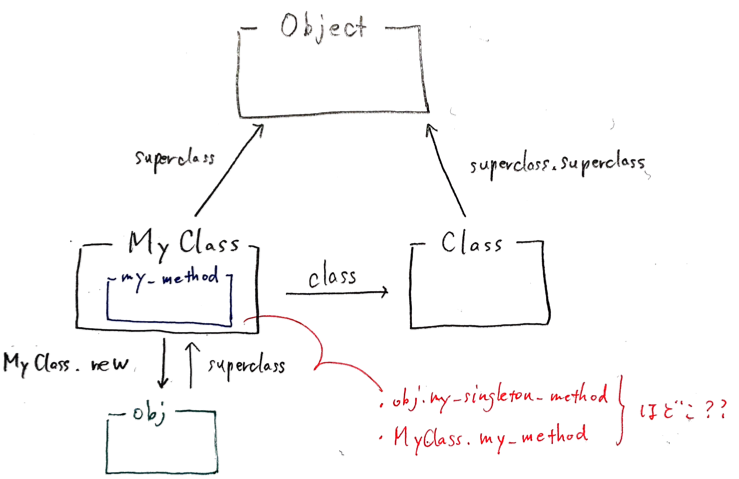
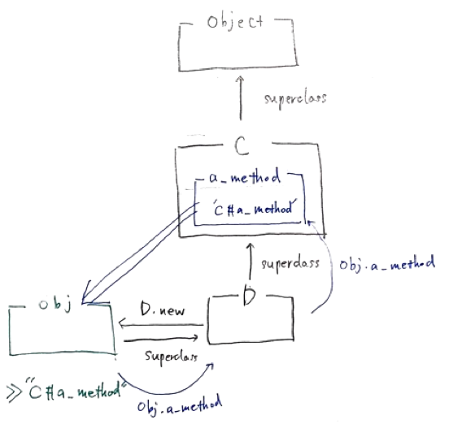
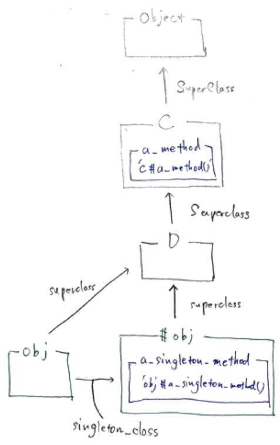
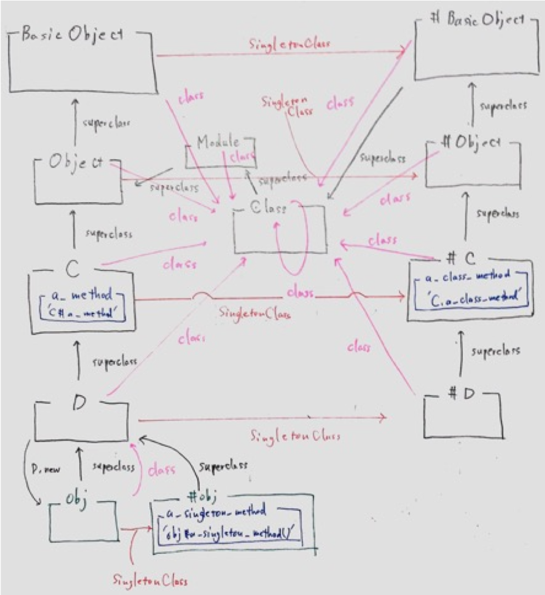

クラス定義
========

* Rubyにおける「クラス定義」は、 **実際にコードを実行している**

* 「クラス定義」は、高性能な **モジュール**

  →クラスについて学んだことは、モジュールにも適用できる

## クラス定義のわかりやすい定義

### クラス定義の中身

* クラスを定義するには、以下の`class文`を使う

```ruby
class クラス名
  クラスの定義
end
```

* クラス(モジュール)定義の中では、クラスがカレントオブジェクト`self`になる・・・オブジェクトのため

```ruby
# クラス定義1
>> class MyClass
>>   puts 'Hello!'
>> end
Hello!
=> nil

# クラス定義2
>> result = class MyClass
>>            self
>>          end
=> MyClass
```

***

### カレントクラス

* Rubyのプログラムでは、常に **カレントオブジェクト`self`** を持っている

  →同様に、クラスやモジュールについても **カレントクラス(モジュール)** を持っている

* メソッドを定義すると、 **カレントクラス** の **インスタンスメソッド** になる

* **カレントオブジェクト** は`self`で参照を獲得できるが、 **カレントクラス** を参照するキーワードは無い

  →コードを見ることで **カレントクラス** を追跡することができる



#### コードを見ることで「カレントクラス」を追跡する方法

* プログラムのトップレベルでは、カレントクラスは`main`のクラスの`Object`になる

  →`irb`などで直接メソッドを定義すると、`Object`の **インスタンスメソッド** になる

* `class`定義でクラスをオープンすると、そのクラスが **カレントクラス** になる

* **メソッド** の中では、 **カレントオブジェクト** のクラスが **カレントクラス** になる

```ruby
>> class C
>>   def m1
>>     def m2; end
>>   end
>> end
=> :m1

>> class D < C; end
=> nil

>> obj = D.new
=> #<D:0x007fbfef035528>
>> obj.m1
=> :m2

>> C.instance_methods(false)
=> [:m1, :m2]
```

#### `class_eval`

* クラス名がわからない時に、クラスをオープンために使う

* カレントクラスを変更することもできる

* `Module#class_eval`は、そこにあるクラスのコンテキストでブロックを評価するもの

```ruby
>> def add_method_to(a_class)
>>   a_class.class_eval do
>>     def m; 'Hello!'; end
>>   end
>> end
=> :add_method_to

>> add_method_to String
=> :m
>> "abc".m
=> "Hello!"
```


* `instance_eval`では、`self`を変更することでスコープ内に入る

* `class_eval`では、`self`と`カレントクラス`を変更することでスコープ内に入る

* `class`が定数を必要とすることに対して、`class_eval`は **クラスを参照している変数** なら何でも使える

* `class`は現在の束縛を捨てて、新しいスコープをオープンするのに対し、`class_eval`はフラットスコープ(２つのスコープを一緒の場所に押し込めて、

  変数を共有する)を持っている

  →`class_eval`ブロックのスコープの外側にある変数も参照できる

#### `instance_eval`と`class_eval`の使い分け

* `instance_eval`：クラス以外のオブジェクトをオープンしたい場合

* `class_eval`：クラス定義をオープンして、defを使ってメソッドを定義したい場合

* `self`の変更：両方使えるが、意図がうまく伝わる方を使う

  * `instance_eval`：「このオブジェクトをオープンしたいが、クラスのことは気にしない」

  * `class_eval`：「ここでオープンクラスを使いたい」

#### カレントクラスのまとめ

* Rubyのインタプリタは、常に **カレントクラス** の参照を追跡している

* defで定義された全てのメソッドは、 **カレントクラスのインスタンスメソッド** になる

* クラス定義の中では、 **カレントオブジェクト`self`** と **カレントクラス(定義しているクラス)** は同じである

* クラスへの参照を持っていれば、クラスは`class_eval`でオープンできる

***

### クラスインスタンス変数

* Rubyインタプリタは、全ての **インスタンス変数** は **カレントオブジェクト`self`** に属している

  →クラス定義でも同じ。`self`はクラス定義のこと

* インスタンス変数`@my_var`はクラスに属していることになる。

  →クラスのインスタンス変数と、クラスの **オブジェクト** のインスタンス変数は別物

```ruby
>> class MyClass
>>   @my_var = 1
>>   def self.read; @my_var; end     # クラスメソッド
>>   def write; @my_var = 2; end     # インスタンスメソッド
>>   def read; @my_var; end          # インスタンスメソッド
>> end
=> :read

>> obj = MyClass.new
=> #<MyClass:0x007fea1f253558>
>> obj.read                          # この時点では、クラスのオブジェクトのインスタンス変数にはまだ代入されいない
=> nil
>> obj.write                         # クラスのオブジェクトのインスタンス変数に代入(@my_var = 2)
=> 2
>> obj.read                          # クラスのオブジェクトのインスタンス変数に代入(@my_var(2))
=> 2
>> MyClass.read                      # クラスのインスタンス変数は、すでに@my_var = 1が定義されている
=> 1
```

#### クラス変数

* `@@`：クラス変数。クラスインスタンス変数とは異なる

* クラス変数は、サブクラスや通常のインスタンスメソッドからもアクセスできる

  →クラスに変数を保存する役割は果たすが、クラスインスタンスメソッドよりも広義

```ruby
>> class C
>>   @@v = 1
>> end
=> 1

>> class D < C
>>   def my_method; @@v; end
>> end
=> :my_method

>> D.new.my_method
=> 1
```

* クラス変数は、「クラス階層」に属している。`main`クラスである`Object`とその子孫に属している

  `MyClass`では、`Object`クラスを継承しているので、同じクラス変数を共有することになる

* トップレベルでクラス変数にアクセスすると警告が表示される

```ruby
>> @@v = 1
(irb):21: warning: class variable access from toplevel
=> 1

>> class MyClass
>>   @@v = 2
>> end
=> 2

>> @@v
(irb):26: warning: class variable access from toplevel
=> 2
```


### リファクタリング

> 2018/10/10
> のちにやる
> →同様に、5.2も

## 特異メソッド

`Paragraph`クラスは、文字列をラップしたクラスである。

全ての呼び出しは文字列に委譲しているが、`Paragraph#title?`だけは委譲せずに文字列が全て大文字のときに`true`を戻すようにしている

`Paragraph`オブジェクトは、`Bookwork`のある特定の場所で生成しており、`title?`メソッドは、アプリケーション全体の`index`メソッドで使われている

問題点としては、`Paragraph`クラスは中身がないこと。

対処法は、

* `String`クラスにモンキーパッチ

* `Refinements`を使って、`String`クラスにパッチを当てる

* **特異メソッド** を使用(今回)

```ruby
class Paragraph
  def initialize(text)
    @text = text
  end

  def title?; @test.upcase == @text; end
  def reverse; @test.reverse; end
  def upcase; @test.upcase; end
  # 省略
end


# アプリケーションで1回のみ使われる
def index(paragraph)
  add_to_index(paragraph) if paragraph.title?
end
```

### 特異メソッドの導入

* Rubyでは、特定のオブジェクトにメソッドを追加できる

* 単一のオブジェクトに特化したメソッドのことを、 **特異メソッド** という

* 特異メソッドは、以下の構文or`Object#define_singleton_method`で定義することができる

```ruby
>> str = "just a regular string"
=> "just a regular string"

>> def str.title?
>>   self.upcase == self
>> end
=> :title?

>> str.title?
=> false
>> str.methods.grep(/title?/)
=> [:title?]
>> str.singleton_methods
=> [:title?]
```

#### ダックタイピング

Rubyでは、オブジェクトの「型」は、そのクラスとは厳密には結びついておらず、

「型」はオブジェクトが反応するメソッドの集合にすぎない

このような流動的な型のことを、`ダックタイピング`という

→「アヒルのように歩いて、アヒルのように泣けば、それはアヒルに違いない」という話に由来

→あるオブジェクトが`Duck`クラスのインスタンスかどうかを気にする必要がない

### クラスメソッドの真実

* クラスは単なるオブジェクトであり、クラス名は単なる定数

* `an_object.a_method`：変数で参照したオブジェクトのメソッドを呼び出している

* `AClass.a_class_method`：定数で参照したオブジェクト(これがクラス)のメソッドを呼び出している

  →これらより、クラスメソッドは **クラスの特異メソッド** である。

```ruby
def obj.a_singleton_method; end          # 特異メソッドの定義
def MyClass.another_class_method; end    # クラスメソッドの定義
```

* 特異メソッドを`def`を使って定義する構文

* `object`の部分には、

  * オブジェクトの参照

  * クラス名の定数

  * `self`

```ruby
def object.method
  # メソッドの中身
end
```

### クラスマクロ

#### `attr_accessor`の例

* Rubyオブジェクトには、アトリビュート(プロパティ)がない

* アトリビュートのようなものが欲しい時は、 **読み込み用** と **書き込み用** の2つのミミックメソッドを定義する

※アトリビュートが必要な理由

クラスの中で使われているインスタンス変数は、クラスの外側から参照したり、値を変更できないので、これを定義できるようにする

```ruby
>> class MyClass
>>   def my_attribute=(value)
>>     @my_attribute = value
>>   end
>>
>>   def my_attribute
>>     @my_attribute
>>   end
>> end
=> :my_attribute

>> obj = MyClass.new
=> #<MyClass:0x007fad49071838>
>> obj.my_attribute = 'x'
=> "x"
>> obj.my_attribute
=> "x"
```

* このようなメソッド(アクセサ)は、`Module#attr*`を用いる

  * `attr_reader`：読み取り用を生成する

  * `attr_writer`：書き込み用を生成する

  * `attr_accessor`：読み書き両用を生成する

```ruby
# 先ほどのコートのリファクタリング
>> class MyClass
>>   attr_accessor :my_attribute
>> end
=> nil

>> obj = MyClass.new
=> #<MyClass:0x007ffbb500fc18>
>> obj.my_attribute = 'x'
=> "x"
>> obj.my_attribute
=> "x"
```

* `attr_*`族のメソッドは、`Module`クラスで定義されているので、`self`がモジュールでもクラスでも使用可能

* `attr_accessor`のようなメソッドを、 **クラスマクロ** と呼ぶ

* クラスマクロはキーワードのように思われるが、クラス定義の中で使える単なるクラスメソッドである

#### クラスマクロの適用

> 2018/10/10
> `deprecate`メソッドが何かを調べる

***

## 特異クラス

### 特異メソッドの謎

* Rubyでは、メソッドを探索するのにレシーバのクラスに向かって **右へ** 、それからクラス階層を **上へ** 進む

```ruby
class MyClass
  def my_method; end
end

obj = MyClass.new
obj.my_method
```

* `obj`に特異メソッドを定義すると、特異メソッドを定義することはどこでもできない

  →どこにあるのか？

  * `obj`はクラスでないので、`MyClass`に住むことができない

  * `MyClass`だと、全てのインスタンスがメソッドを共有してしまう

```ruby
# 特異メソッド
def obj.my_singleton_method; end

# クラスメソッド(特異メソッド)
def MyClass.my_class_method; end
```




### 特異クラスの出現

* Rubyでは、裏に特別なクラスとして定義されているオブジェクトの **特異クラス** (メタクラス、シングルトンクラス)を持つ

* `Object#class`では特異クラスを丁寧に隠してしまうが、回避することも可能

#### 特異クラスの参照

* 特異クラスのスコープに連れて行く構文は以下のように表される

```ruby
class << an_object
  # コードの定義
end
```

* 特異クラスの参照を取得したければ、スコープの外に`self`を返す

  →`Object#singleton_class`：特異クラスを参照する`self`を戻すことなく参照できる

```ruby
>> obj = Object.new
=> #<Object:0x007f9b06851f80>
>> singleton_class = class << obj
>>   self
>> end
=> #<Class:#<Object:0x007f9b06851f80>>

>> singleton_class.class
=> Class

>> "abc".singleton_class
=> #<Class:#<String:0x007f9b07833840>>
```

#### 特異クラスの特徴

* `Object#singleton_class`、`class <<`の構文でしか参照できない

* インスタンスを１つしか持てない

* 継承ができない

* **特異クラスは、オブジェクトの特異メソッドが住んでいる場所**

```ruby
>> def obj.my_singleton_method; end
=> :my_singleton_method
>> singleton_class.instance_methods.grep(/my_/)
=> [:my_singleton_method]
```

### メソッド探索再び

#### メソッド探索のおさらい

```ruby
>> class C
>>   def a_method
>>     'C#a_method()'
>>   end
>> end
=> :a_method

>> class D < C; end
=> nil
>> obj = D.new
=> #<D:0x007faf11037290>
>> obj.a_method
=> "C#a_method()"
```



#### 特異クラスとメソッド探索

* 特異クラスを探索すると、人間には読めない名前になっている。画面上では、以下のように表示される

```ruby
>> obj = D.new
=> #<D:0x007fd16ea9f230>
>> obj.singleton_class
=> #<Class:#<D:0x007fd16ea9f230>>
```

* 特異メソッドを定義して、特異クラスのスーパークラスを探索すると以下のようになる

```ruby
>> class << obj
>>   def a_singleton_method
>>     'obj#a_singleton_method()'
>>   end
>> end
=> :a_singleton_method

>> obj.singleton_class.superclass
=> D
```

* 特異メソッドは、通常のクラスではなく、特異クラスのメソッドから探索を始める

* 特異クラスにメソッドがなければ、継承チェーンを上へ進み、特異クラスのスーパークラスにたどり着く




### 特異クラスと継承

* クラスと特異クラスとスーパークラスの繋がりは、以下のコードと図から説明できる

```ruby
>> class C
>>   class << self
>>     def a_class_method
>>       'C.a_class_method()'
>>     end
>>   end
>> end
=> :a_class_method
>>
?> C.singleton_class
=> #<Class:C>
>> D.singleton_class
=> #<Class:D>
>> D.singleton_class.superclass
=> #<Class:C>
>> C.singleton_class.superclass
=> #<Class:Object>
```



まとめると・・・

* 特異クラスのスーパークラスは、スーパークラスの特異クラス

* サブクラスから、クラスメソッドを呼び出すことができる

```ruby
D.a_class_method>> D.a_class_method
=> "C.a_class_method()"
```


#### 大統一理論

Rubyのオブジェクトモデルには、

* クラス、特異クラス、モジュール

* インスタンスメソッド、クラスメソッド、特異メソッド

がある


#### Rubyのオブジェクトモデルのルール

1. オブジェクトは1種類しかない。それが通常のオブジェクトかモジュールになる

1. モジュールは1種類しかない。それが通常のモジュール、クラス、特異クラスのいずれかになる

1. メソッドは1種類しかない。メソッドはモジュール(大半はクラス)に住んでいる

1. 全てのオブジェクトは(クラスも含めて)「本物のクラス」を持っている。それが通常のクラスか特異クラスである

1. 全てのクラスは(BasicObjectをのぞいて)１つの祖先(スーパークラスかモジュール)を持っている。

  あらゆるクラスがBasicObjectに向かって1本の継承チェーンを持っている

1. オブジェクトの特異クラスのスーパークラスは、オブジェクトのクラスである。クラスの特異クラスのスーパークラスは、

  スーパークラスの特異クラスである

1. メソッドを呼び出すときは、Rubyはレシーバの本物のクラスに向かって「右へ」進み、継承チェーンを「上へ」進む


#### クラスメソッドの構文

* クラスメソッドは、クラスの特異クラスにある特異メソッド

* 定義方法は3通りある

```ruby
# 1つ目
def MyClass.a_class_method; end

# 2つ目
class MyClass
  def self.another_class_method; end
end

# 3つ目
class MyClass
  class << self
    def yet_another_class_method; end
  end
end
```

* 1つ目：コードの重複があるので避ける

* 2つ目：クラス定義の中の`self`がクラス自身になることをうまく利用(通常)

* 3つ目：特異クラスをオープンして、そこにメソッドを定義している(巧妙的)


#### 特異クラスと`instance_eval`

* `instance_eval`は、

  * `self`を変更する

  * カレントクラスも変更する

    →カレントクラスを、レシーバの **特異クラス** に変更する

```ruby
>> s1, s2 = "abc", "def"
=> ["abc", "def"]

>> s1.instance_eval do
>>   def swoosh!; reverse; end
>> end
=> :swoosh!

>> s1.swoosh!
=> "cba"
>> s2.respond_to?(:swoosh!)
=> false
```


#### クラスのアトリビュート

* オブジェクトのアトリビュートは、以下のように定義される

```ruby
>> class MyClass
>>   attr_accessor :a
>> end
=> nil

>> obj = MyClass.new
=> #<MyClass:0x007fd16f8401c8>
>> obj.a = 2
=> 2
>> obj.a
=> 2
```

* クラスのアトリビュートを定義するときは、`Class`クラスにオープンして定義するのではなく、特異クラスにアトリビュートを定義する

```ruby
# Classクラスにアトリビュートを定義(NG：全てのクラスに定義したアトリビュートが追加される)
>> class MyClass; end
=> nil

>> class Class
>>   attr_accessor :b
>> end
=> nil

>> MyClass.b = 42
=> 42
>> MyClass.b
=> 42

>> class Hoge; end
=> nil
>>
>> Hoge.b = 4
=> 4
>> Hoge.b                 # 関係ないクラスまで定義されてしまう
=> 4

# 特異クラスにアトリビュートを設定する
>> class MyClass
>>   class << self
>>     attr_accessor :c
>>   end
>> end
=> nil

>> MyClass.c = 'It works!'
=> "It works!"
>> MyClass.c
=> "It works!"

>> class Hoge; end
=> nil
>> Hoge.c = 'It does not work!'
NoMethodError: undefined method `c=` for Hoge:Class
```

* クラスアトリビュートは、以下のコードで記述される

```ruby
def MyClass.c=(value)
  @c = value
end

def MyClass.c
  @c
end
```


### モジュールと特異クラス

#### クラスメソッドと`include`

* クラス拡張：クラスの特異クラスにメソッドを定義して、クラスメソッドを定義すること

* オブジェクト拡張：クラスの特異インスタンスメソッドを定義して、オブジェクトにインスタンスメソッドを追加すること

```ruby
# クラス拡張
>> module MyModule
>>   def my_method; 'Hello'; end
>> end
=> :my_method

>> class MyClass
>>   class << self
>>     include MyModule
>>   end
>> end
=> #<Class:MyClass>

>> MyClass.my_method
=> "Hello"

# オブジェクト拡張
>> module MyModule
>>   def my_method; 'Hello'; end
>> end
=> :my_method

>> obj = Object.new
=> #<Object:0x007f840c00cfc0>

>> class << obj
>>   include MyModule
>> end
=> #<Class:#<Object:0x007f840c00cfc0>>

>> obj.my_method
=> "Hello"
>> obj.singleton_methods
=> [:my_method]
```

#### `Object#extend`

* `Object#extend`：クラス拡張・オブジェクト拡張を行うためだけのメソッド

* レシーバの特異クラスにモジュールをインクルードするためのショートカット

```ruby
>> module MyModule
>>   def my_method; 'hello'; end
>> end
=> :my_method

>> obj = Object.new
=> #<Object:0x007f8eda00dfc8>
>> obj.extend MyModule
=> #<Object:0x007f8eda00dfc8>
>> obj.my_method
=> "hello"

>> class MyClass
>>   extend MyModule
>> end
=> MyClass

>> MyClass.my_method
=> "hello"
```

***

## メソッドラッパー

### アラウンドエイリアス

* `Module#alias_method`：Rubyのメソッドにエイリアス(別名)をつけることができる

* メソッドの新しい名前を先に、メソッドの元の名前を後に書く

* 名前は、シンボルor文字列で渡す

```ruby
>> class MyClass
>>   def my_method; 'my_method()'; end
>>   alias_method :m, :my_method
>> end
=> MyClass

>> obj = MyClass.new
=> #<MyClass:0x007f85b1838590>
>> obj.my_method
=> "my_method()"
>> obj.m
=> "my_method()"
```

* メソッドの再定義とは、新しいメソッドを定義して、元のメソッドの名前をつけること

* 元のメソッドをエイリアスで呼ぶことができる

* アラウンドエイリアスは、「新しいメソッドを古いメソッドで囲む」こと

  1. メソッドにエイリアスをつける

  2. メソッドを再定義する

  3. 新しいメソッドから古いメソッドを呼び出す

* 欠点：

  * 新しいメソッド名でクラスを汚染する(モンキーパッチの一種)

  * 読み込みを2回行なってはいけない(メソッドを呼び出したときに、例外が発生する可能性がある)

### アラウンドエイリアスのメソッドラッパー

#### `Refinements`

* `Refinements`は、クラスのコードにパッチを貼り付けるもの

  →アラウンドエイリアスの代わりにも使うことができる

* リファインしたメソッドから`super`を呼び出すと、元のリファインしていないメソッドが呼び出せる

* 適用されるのは、ファイルの最後まで：あらゆるところに適用されるアラウンドエイリアスよりも、こちらの方が一般的に安全

```ruby
module StringRefinements
  refine String do
    def length
      super > 5 ? 'long' : 'short'
    end
  end
end

using StringRefinements

"War and Peace".length
=> "long"
```

#### `prepend`

* `prepend`は、継承チェーンでインクルーダーの下にモジュールが挿入される

  →プリペンドしたモジュールが、インクルーダーのメソッドをオーバーライドできる

  →元のメソッドは`super`で呼び出すことができる

```ruby
>> module ExplicitString
>>   def length
>>     super > 5 ? 'long' : 'short'
>>   end
>> end
=> :length

>> String.class_eval do
>>   prepend ExplicitString
>> end
=> String

>> "War and Peace".length
=> "long"
```
