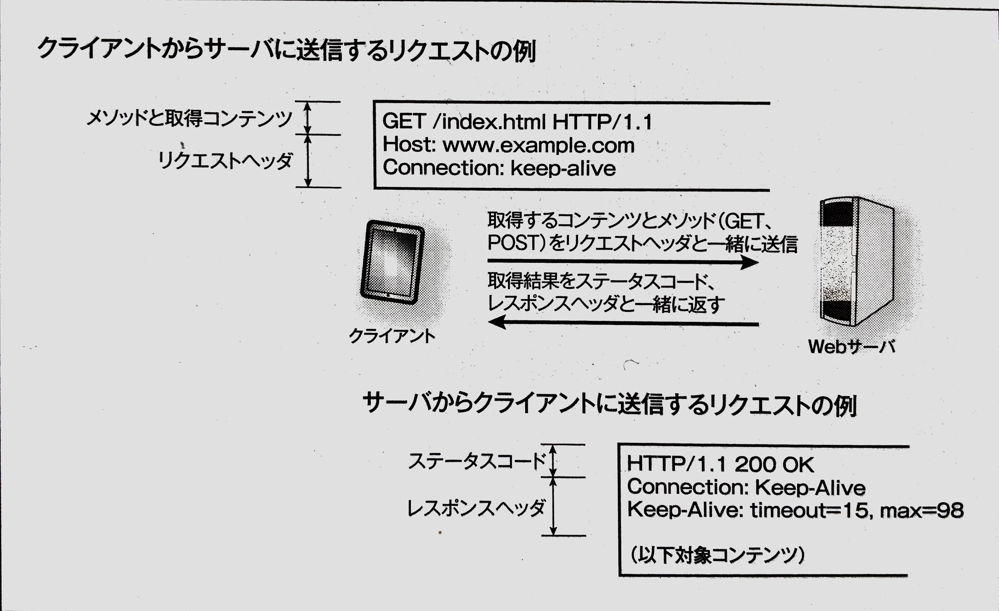

09 net/httpモジュール
===================

## 目次

* [net/httpモジュールとは](#1nethttpモジュールとは)

* [HTTPの通信の仕組み](#2HTTPの通信の仕組み)

* [接続されていないインスタンスの作成(new)](#3接続されていないインスタンスの作成new)

* [接続のオープンとクローズ(start/finish)](#4接続のオープンとクローズstartfinish)

* [コンテンツの取得](#5コンテンツの取得)

* [HTTPRequest](#6HTTPRequest)

* [HTTPResponse](#7HTTPResponse)


## 1.net/httpモジュールとは

* Netモジュール以下には、以下のライブラリが用意されている

  * ネットワークで広く利用されているプロトコルのライブラリ

  * それぞれ対応したサーバーと通信するためのクライアント用ライブラリ

  > net/httpはその中の１つで、HTTPを取り扱うことができる

* net/httpでは、以下のものなどをライブラリ側で処理してくれる

  * HTTP通信の中のリクエストデータの組み立て

  * サーバーへの通信

  * レスポンスデータの処理

* net/httpは、以下の3つのクラスで構成されている

  |      クラス      |            内容            |
  |:----------------|:--------------------------|
  |Net::HTTP        |HTTPクライアントのためのクラス  |
  |Net::HTTPRequest |HTTPリクエストを抽象化するクラス|
  |Net::HTTPResponse|HTTPレスポンスを抽象化するクラス|


## 2.HTTPの通信の仕組み

* TCPの80番ポートを使って通信するテキストベースのプロトコル

* 通信は、クライアント(Webブラウザなど)から行う

* クライアントはサーバーに対して、取得対象コンテンツへのパスと命令(メソッド)を指定し、以下のものと一緒に送信する

  * リクエストヘッダ(クライアントの設定や属性など)

  * リクエストボディ(クライアントから送信するデータ)

* メソッドは、クライアントやサーバーによって使用できるものが異なるが、ほとんどのサーバー・クライアントで以下のものが使用できる

  * `GET`：コンテンツの取得

  * `POST`：データの投稿

* サーバーはクライアントからの命令を解釈し、処理結果をクライアントに返す




## 3.接続されていないインスタンスの作成(new)

* `Net::HTTP.new`：指定したアドレス、ポートで`Net::HTTP`インスタンスを作成する

  * 接続の際に経由するプロキシサーバーを指定できる。この方法でインスタンスを作成すると、接続が未オープンの状態で作成される

```ruby
Net::HTTP.new(address, port = 80, procy_addr = nil, proxy_port = nil)
```


## 4.接続のオープンとクローズ(start/finish)

* `start`：`Net::HTTP`インスタンスの接続をオープンする

  * ブロックを渡すと、ブロックの終了時に自動的にfinishメソッドを実行する

  * ブロック引数には、自分自身のインスタンスが代入される

* `finish`：`Net::HTTP`インスタンスの接続をクローズする。

```ruby
start
start{|http| ... }
finish
```

* `Net:HTTP.start`メソッドは、接続がオープンの状態でインスタンスを作成する

  * ブロックを渡すと、startメソッドと同様にブロックを抜けると同時に接続をクローズする

```ruby
Net::HTTP.start(address, port = 80, procy_addr = nil, proxy_port = nil)
Net::HTTP.start(address, port = 80, procy_addr = nil, proxy_port = nil){|http| ....}
```


## 5.コンテンツの取得

* `get`・`Net::HTTP.get`：GETメソッドを利用して、pathからコンテンツの取得を試みる

  * headerは、リクエストヘッダに渡す値をヘッダ名と値のHashで渡す

  * 接続がクローズされていた場合、自動的にオープンして接続を行い、戻り値には`Net::HTTPResponse`の

  * サブクラス(Net::HTTPOKクラス、Net::HTTPNotFoundクラス)のインスタンスが返る

* `Net::HTTP.get`は、インスタンスを作らずに、直接コンテンツの取得を試みる。戻り値は文字列が返る

```ruby
get(path, header = nil)
Net::HTTP.get(address, path, port = 80)
```

例)
Net::HTTPを使用した、HTMLの取得サンプル

```ruby
require 'net/http'

# サンプル1：接続がみオープンのインスタンスを作成し、コンテンツを取得する
net = Net::HTTP.new("docs.ruby-lang.org")
net.start
res = net.get("/ja/2.1.0/doc/index.html")
net.finish
p res.body
=> ""

# サンプル2：接続がオープンのインスタンスを作成し、startメソッドにブロックを渡してコンテンツを取得する
net = Net::HTTP.new("docs.ruby-lang.org")
net.start{|http|
  res = http.get("/ja/2.1.0/doc/index.html")
}
p res
=> #<Net::HTTPMovedPermanently 301 Moved Permanently readbody=true>

# サンプル3：Net::HTTP.getで直接コンテンツを取得する
body = Net::HTTP.get("docs.ruby-lang.org", "/ja/2.1.0/doc/index.html")
p body.force_encoding("UTF-8")
=> ""
```

* `post`：POSTメソッドで、pathからのコンテンツの取得を試みる

  * リクエスト送信時にdata文字列を送信する。戻り値には、HTTPResponseクラスが返る

  * destには、<<メソッドを持つクラスのインスタンス(String、Arrayなど)を指定できる

  * destを与えた場合は、<<メソッドを使ってレスポンスをdestに書き込む

```ruby
post(path, data, header = nil, dest = nil)
```


## 6.HTTPRequest

* コンテンツ取得時にサーバーがBASIC認証を要求したり、細かいリクエストのパラメータを調整したい場合は`Net::HTTPRequest`を使用

* このクラスは、以下の4つのサブクラスに実装が定義されている

  * `Net::HTTP::Get`

  * `Net::HTTP::Post`

  * `Net::HTTP::Head`

  * `Net::HTTP::Put`

* 作成したHTTPRequestインスタンスを使ってサーバーと通信するには、`request`メソッドを使用する

```ruby
require 'net/http'

http = Net::HTTP.new("www.ruby-lang.org", 80)
req = Net::HTTP::Get.new("/ja/documentation/")
res = http.request(req)
p res.body
```


### 実行結果


### new

* Net::HTTPRequestのインスタンスを作成する

```ruby
Net::HTTP::Get.new(path)

Net::HTTP::Post.new(path)

Net::HTTP::Head.new(path)

Net::HTTP::Put.new(path)
```


### self

* リクエストヘッダに、値をセットする

```ruby
self[key]
self[key] = val
```


### basic_auth

* BASIC認証用のヘッダを作成する

  * account:passwordの文字列をBASE64でエンコードしたものを、Authorizationヘッダにセットする

```ruby
basic_auth(account, password)
```

例)
BASIC認証用のヘッダを作成する

```ruby
require 'net/http'

req = Net::HTTP::Get.new("/ja/documentation")
req.basic_auth("rubyuser", "password")
p req["authorization"]
=> "Basic cnVieXVzZXI6cGFzc3dvcmQ="
```


## 7.HTTPResponse

* `Net::HTTP.get`などでコンテンツの取得を行うと、戻り値は`Net::HTTPResponse`のサブクラスのインスタンスが返る

  * 戻り値には、リクエスト結果のステータスコード、レスポンスヘッダや取得したコンテンツの内容が含まれている

```ruby
code
message
```

* リクエストの取得結果のステータスコードとメッセージを取得する

|ステータスコード|     メッセージ     |                                    意味                                   |
|:------------|:------------------|:-------------------------------------------------------------------------|
|     200     |OK                 |要求は正常に取得しました                                                      |
|     302     |Found              |要求への応答は別のURIにある。レスポンスヘッダのLocationに移動後のコンテンツのURIがある|
|     404     |NotFound           |要求されたURIに一致するものをサーバー上で見つけることができませんでした。             |
|     500     |InternalServerError|サーバー内部のエラー                                                         |


### self

* レスポンスヘッダを取得する

```ruby
self[key]
```


### body

* コンテンツを取得する

```ruby
body
```

例)

ステータスコード301のHTTPResponseインスタンスから、正しいURIを取得する

```ruby
require 'net/http'

res = nil
Net::HTTP.start("docs.ruby-lang.org"){|http|
  res = http.get("/")
}
p res.code
=> "301"

# ステータスコードが301の場合、移動後のURIはLocationヘッダに格納されている
p res["location"]
=> "https://docs.ruby-lang.org/"
```


| 版     | 年/月/日   |
| ------ | ---------- |
| 初版   | 2018/10/21 |
| 第二版 | 2019/05/13 |
