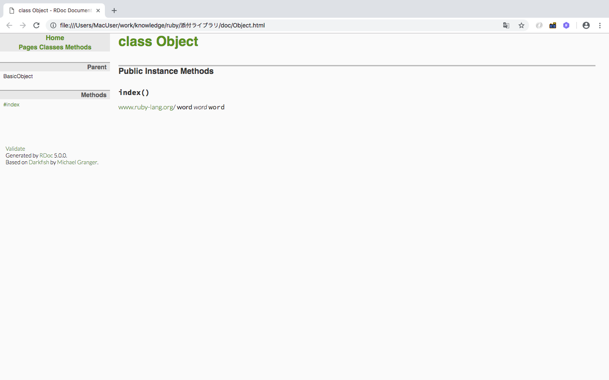
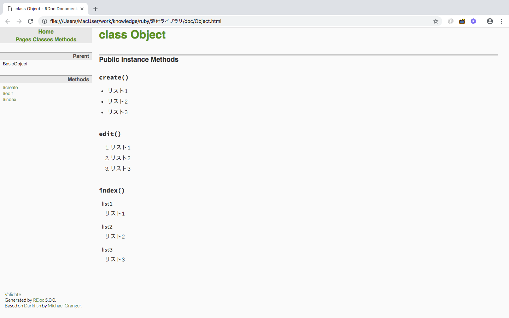

13 RDoc
=======

## 目次

* [RDocとは](#1RDocとは)

* [RDocの利用例](#2RDocの利用例)

* [RDocのドキュメント生成](#3RDocのドキュメント生成)

* [マークアップ](#4マークアップ)


## 1.RDocとは

* Rdoc(Ruby Document System)

* ソースコードからHTML形式のAPI仕様書を出力するコマンドツール

* ソースコードを解析して、クラス、モジュール、メソッドの定義やinclude、requireの関係を抽出したものを、直前のコメントと併合してHTMLに出力


## 2.RDocの利用例

* コメントは「#」から始まる形式でも、`=begin〜=end`で囲んだ式でも利用できる

```ruby
# この行はRDocによって読み込まれます
def comment
end

=begin
この行はRDocに読み込まれます
=end
def begin_end_comment
end
```


## 3.RDocのドキュメント生成

* RDocを実行すると、カレントディレクトリ以下にあるファイルを探し、RDocのパーサーに対応したファイルの解析を行う

* 解析したファイルはHTMLに変換され、docディレクトリ以下に配置される

```ruby
rdoc
```


## 4.マークアップ

* コメントに特殊なマークアップを行うことで、出力されるドキュメントをマークアップすることができる


### 見出し

* `=`の個数に応じて、見出し行`<h1>`〜`<h6>`に変換される

* `=`が7個以上の場合は、全て`<h6>`になる

```ruby
# = Head1
# == Head2
# === Head3
# ==== Head4
# ===== Head5
# ====== Head6
```


### インライン

* URI形式(http://〜、ftp://〜)で始まる形式の文字列は、自動的にリンクになる

```ruby
# http://www.ruby-lang.org/
```

* 文字列をアスタリスク`*`で囲むと、ボールド体で装飾できる

* <b>word</b>でも使用できる

```ruby
# *word*
```

* 文字列をアンダースコア`_`で囲むと、イタリック体で装飾できる

* <em>word</em>でも使用できる

```ruby
# _word_
```

* 文字列をプラス`+`で囲むと、タイプライター体で装飾できる

* <tt>word</tt>でも使用できる

```ruby
# +word+
```




### リスト

* 番号なしリスト：アスタリスク`*`またはマイナス`-`で文字列を開始すると、番号なしリストを作ることができる

  ```ruby
  # * リスト1
  # * リスト2
  # * リスト3

  # - リスト1
  # - リスト2
  # - リスト3
  ```

* 番号付きリスト：数字+ピリオド`.`で文字列を開始すると、番号付きリストを作ることができる

  ```ruby
  # 1. リスト1
  # 2. リスト2
  # 3. リスト3
  ```

* ラベル付きリスト：大カッコ`[]`で囲んだ文字列で開始すると、ラベル付きリストを作成することができる

  ```ruby
  # [list1] リスト1
  # [list2] リスト2
  # [list3] リスト3
  ```

  コロン`:`で区切っても、ラベル付きリストを作成できる。コロンの右の文字は左揃えになる

  ```ruby
  # list1:: リスト1
  # list2:: リスト2
  # list3:: リスト3
  ```




| 版     | 年/月/日   |
| ------ | ---------- |
| 初版   | 2018/10/21 |
| 第二版 | 2019/05/13 |
