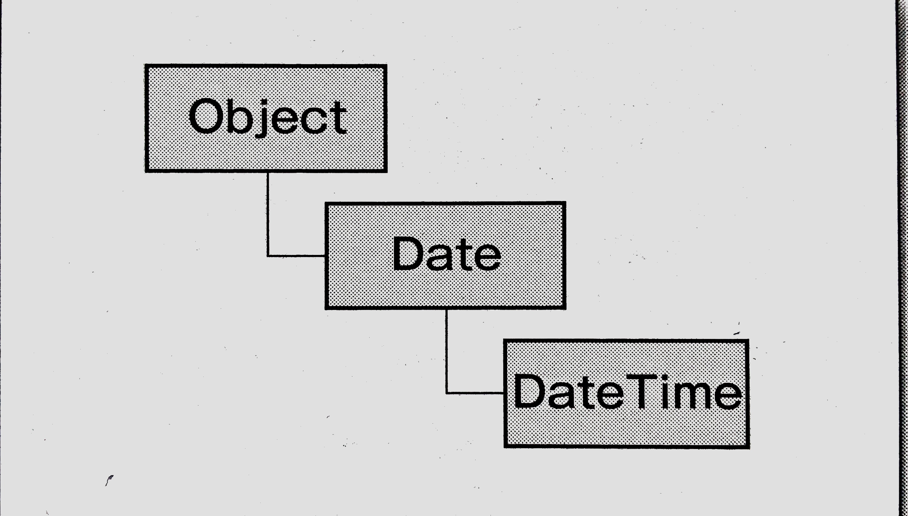

6-6.日付・時間
============

dateライブラリには、

* `Date`：日付を扱うクラス

* `DateTime`：日付と時間を扱うクラス

が含まれる



## Date、DateTimeの時間データの持ち方

DateクラスやDateTimeクラスは、ユリウス日(紀元前4713年1月1日 正午12:00)からの時間の経過をRationalクラスで持つ。

整数部を日付、小数部を時間に割り当てている。そのため、1日未満の日付の加算や減算もRationalクラスで行う必要がある。

```ruby
require 'date'

# Date、DateTime同士の減算結果はRationalで返る
>> p DateTime.new(2011, 7, 19) - DateTime.new(2010, 8, 27)
=> (326/1)

# <<、>>メソッドは、それぞれnヶ月前、nヶ月後の日付オブジェクトを返す
>> date = Date.new(2010, 10, 1)
>> p date << 3
=> #<Date: 2010-07-01 ((2455379j,0s,0n),+0s,2299161j)>
```

## Date

### `civil`・`new`

Dateクラスのインスタンスを作成する。year(年)、mon(月)、mday(日)を指定できる。

全て省略すると、紀元前4713年1月1日が設定される。

### `start`

グレコリオ歴を使い始めた日(国によって異なる)を表すユリウス日(紀元前4713年1月1日 正午12:00)

Dateクラスでは紀元前1年1日1日を0-01-01と表記する。ユリウス日(-47132-01-01)

省略した場合は、`Date::ITALY`(1582年10月15日)が使用される

```ruby
Date.civil([year[, mon[, mday[, start]]]])
Date.new([year[, mon[, mday[, start]]]])
```

### `parse`

文字列からDateインスタンスを生成するメソッド。strに与えた文字から、年月日、時分秒、タイムゾーンなどを判定して、

Dateインスタンスに変換する。引数completeにtrueを渡すと、年(year)が2桁表記だった場合(99/01/01など)に4桁表記(1999)に変換する。

yearが69以上であれば1900年代と判定され、68以下であれば2000年代と判定される。("69-01-01"："1969-01-01"、"68-01-01"："2068-01-01")

月日に不正な値が入ると、`ArgumentError`が発生する

```ruby
Date.parse(str[, complete[, start]])

# 例
require 'date'

>> p Date.parse("2011-01-01")
=> #<Date: 2011-01-01 ((2455563j,0s,0n),+0s,2299161j)>

# completeオプションにfalseを指定した場合、2桁の年表記はそのまま解釈。デフォルトではcompleteオプションはtrue
>> p Date.parse("11-01-01", false).to_s
=> "0011-01-01"


>> p Date.parse("11-01-01", true).to_s
=> "2011-01-01"

# completeオプション指定時に69年は1969年、68年は2068年と解釈
>> p Date.parse("68-01-01").to_s
=> "2068-01-01"

>> p Date.parse("69-01-01").to_s
=> "1969-01-01"
```

### `strptime`

文字列からDateインスタンスを生成するメソッド。formatに与えられた整形ルールに基づいて、strに与えた文字列をDateインスタンスに変換。

formatに指定できるものは、組み込みクラスの`Time#strftime`と同じ。

パースに失敗すると、`ArgumentError`が発生する

```ruby
Date.strptime(str[, format[, start]])

# 例
require 'date'

p Date.strptime("2011/01/01", "%Y/%m/%d")
=> #<Date: 2011-01-01 ((2455563j,0s,0n),+0s,2299161j)>

p Date.strptime("May 5, 2010", "%b %d, %Y")
=> #<Date: 2010-05-05 ((2455322j,0s,0n),+0s,2299161j)>
```

### `today`

本日の日付でDateインスタンスを生成する

```ruby
Date.today(start = Date::ITALY)
=> #<Date: 2018-10-20 ((2458412j,0s,0n),+0s,2299161j)>
```

### 年月日を得るメソッド

* `year`：年を得るメソッド

* `month`・`mon`：月を得るメソッド

* `day`・`mday`：日を得るメソッド

```ruby
require 'date'

day = Date.today(start = Date::ITALY)
p day.year
=> 2018
```

### `next`・`succ`

呼び出したDateインスタンスの次の日を返す

```ruby
require 'date'

# 本日は、2018/10/20
day = Date.today(start = Date::ITALY)
p day.next
=> #<Date: 2018-10-21 ((2458413j,0s,0n),+0s,2299161j)>
```

### 日付をブロックで実行するメソッド

* `step`：Dateインスタンスげ現在示している日付からlimitで指定した日付になるまで、ブロック内を繰り返し実行する。

  実行後は自分自身の日付インスタンスを返す。limitはDateまたはDateTimeインスタンス、stepは0以外である必要がある

* `downto`：`step(min, -1){|date| ...}`と同等

* `upto`：`step(max, 1){|date| ...}`と同等

```ruby
step(limit, step){|date| ...}
downto(min){|date| ...}
upto(max){|date| ...}

# 例
require 'date'

start_from = Date.new(2017, 7, 1)
end_to = Date.new(2017, 7, 31)
start_from.step(end_to, 7) do |date|
  p date.to_s
end

# 実行結果
"2017-07-01"
"2017-07-08"
"2017-07-15"
"2017-07-22"
"2017-07-29"
```

### `leap?`

うるう年であればtrueを返す

```ruby
require 'date'

>> year = Date.new(2017, 7, 1)
>> p year.leap?
=> false
```

### 日付を文字列に変換する

* `to_s`：日付インスタンスを文字列に変換する。YYYY-MM-DDの形式で出力される

* `strftime`：日付インスタンスを文字列に変換する。formatに指定した整形ルールに基づいて文字列を生成する。

  整形ルールは組み込みクラスの`Time#strftime`と同じ

```ruby
to_s
strftime([format])
```

***

## DateTime

Dateクラスのサブクラスで、日付以外に時間やタイムゾーンが保持できる

### `civil`・`new`

DateTimeクラスのインスタンスを生成する

year、mon、mdayに加えてhour、min、sec、offsetに時、分、秒、時差を指定する

offsetはRational、もしくは文字列で指定する

全て省略すると、ユリウス日「紀元前4713年1月1日0時0分0秒UTC(協定世界時)」でインスタンスが作成される

```ruby
# DateTimeインスタンスを作成
require 'date'

>> DateTime.civil(year = -4712, mon=1, mday=1, hour=0, min=0, sec=0, offset=0, start=Date::ITALY)
=> #<DateTime: -4712-01-01T00:00:00+00:00 ((0j,0s,0n),+0s,2299161j)>
>> DateTime.new(year = -4712, mon=1, mday=1, hour=0, min=0, sec=0, offset=0, start=Date::ITALY)
=> #<DateTime: -4712-01-01T00:00:00+00:00 ((0j,0s,0n),+0s,2299161j)>

# DateTimeインスタンスの作成
require 'date'

>> DateTime.new(2017, 7, 1, 12, 0, 0, Rational(9, 24)).to_s
=> "2017-07-01T12:00:00+09:00"
>> DateTime.new(2017, 7, 1, 12, 0, 0, "+0900").to_s
=> "2017-07-01T12:00:00+09:00"
```

### now

現在時刻でDateTimeインスタンスを生成する

```ruby
DateTime.now([start])

# 例
require 'date'

>> DateTime.now
=> #<DateTime: 2018-10-20T14:51:53+09:00 ((2458412j,21113s,554919000n),+32400s,2299161j)>
```

### 時分秒を得るメソッド

* `hour`：時を得るメソッド

* `min`：分を得るメソッド

* `sec`：秒を得るメソッド

* `zone`：タイムゾーンを得るメソッド。文字列表現で返す。

* `offset`：タイムゾーンを得るメソッド。Rationalクラスで返す。

```ruby
require 'date'

>> time = DateTime.new(2017, 7, 1, 0, 0, 0, "+0900")
>> time.hour
=> 0
>> time.min
=> 0
>> time.sec
=> 0
>> time.zone
=> "+09:00"
>> time.offset
=> (3/8)
```


| 版 |  年/月/日 |
|---|----------|
|初版|2018/10/20|
