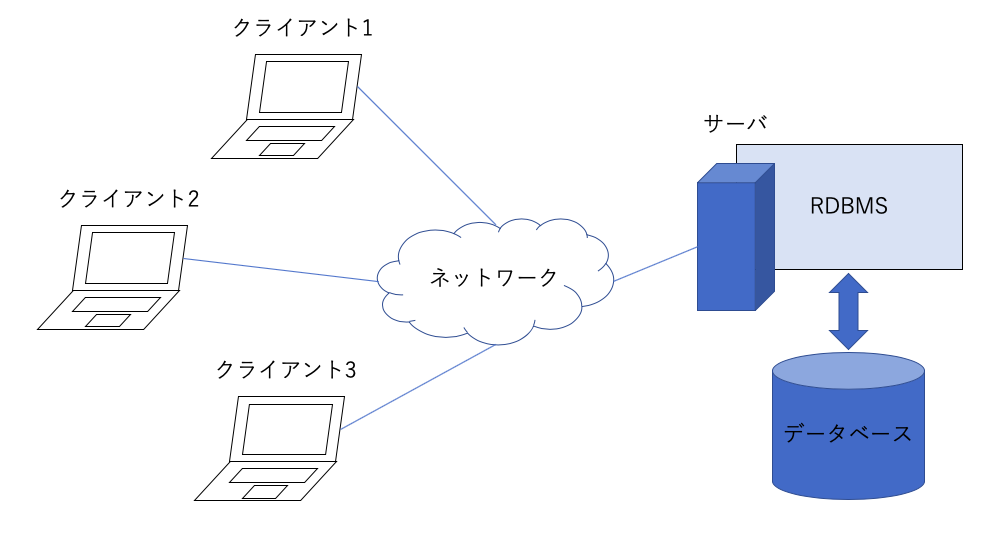
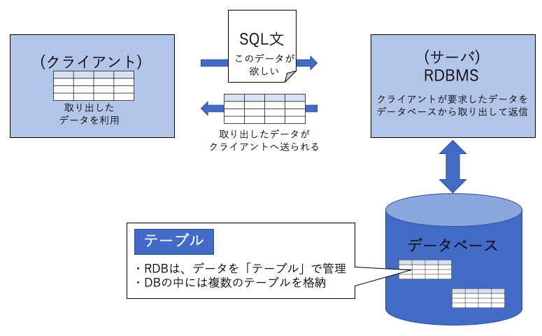

1-2 データーベースの構成
====================

## 学習のポイント

* RDBMSは一般的に、`クライアント/サーバ型`のシステム構成で使用される

* データベースを読み書きするには、サーバであるRDBMSにクライアントから`SQL文`を送信する

* リレーショナルデータベースでは、`テーブル`あるいは`表`と呼ばれる2次元表でデータを管理する

* `テーブル`は、データ項目を表す`列(カラム)`と、1件のデータを表す`行(レコード)`からなる

* データの読み書きは、`レコード`単位で行われる

* `列`と`行`が交わる1つのマス目を`セル`と呼ぶ。1つの`セル`には1つのデータしか入れることができない

## RDBMSの一般的なシステム構成

* RDBMSを利用する際のシステム構成は、`クライアント/サーバ型(C/S型)`と呼ばれる形態が最も一般的

* `サーバ`：他のプログラムからの要求を受け取り、それに応じて処理を行うタイプの

  * プログラム(ソフトウェア)、

  * そのプログラムがインストールされたマシン(コンピュータ)

  のこと

  コンピュータ上で動作し続けて、要求が届くのを待つ

  ハードディスクなどに保存されているデータベースからデータを取り出して返したり、指示された内容でデータを書き換える

* `クライアント`：サーバに要求を出す

  * プログラム(ソフトウェア)

  * そのプログラムがインストールされたマシン(コンピュータ)

  のこと

  ->RDBMSが管理しているデータベースにアクセスして、そのデータを読み書きするプログラムは、RDBMSのクライアント

* `SQL文`：RDBMSのクライアントが、サーバであるRDBMSにどんなデータを送って欲しいか、を表す文

  RDBMSはその文にしたがって、要求されたデータを返信したり、DBに保存されているデータを書き換えたりする

* RDBMSは1台のコンピュータの中でRDBMSとそのクライアントを動かすことができたり、RDBMSトクライアントを別々のコンピュータ上で動かすことができる

  ->その場合、ネットワークで両者を繋ぐだけでなく、1つのRDBMSは複数のクライアントから利用できる

* SQLをRDBMSに送ることができれば、クライアントは同じプログラムである必要はない

* さらに、それらは同時に１つのデータベースを読み書きすることができる

* RDBMSは多数のクライアントから要求を受け取る他にも、大量のデータを保管しているデータベースを処理する必要があるため、

  一般にはクライアントを動かすコンピュータよりも高性能なコンピュータを使用する

  ->巨大なデータベースを扱う場合には、複数のコンピュータを組み合わせることがある

* RDBMSには様々なシステム構成があるが、クライアントから送信するSQL文は基本的に変わらない

## テーブルの構造

* `テーブル(表)`：RDBMSでいう、データを管理している2次元の表

* RDBMSが管理するデータベースの中に、テーブルは保存される

* 1つのデータベースの中には、複数のテーブルを保存できる

* SQL文の内容に従ってクライアントに返信されるデータも、必ずテーブルと同じように2次元表の形

  ->RDBの特徴の１つであり、結果が2次元表にならないSQL文は実行できない

### テーブルの例

* `列(カラム)`：テーブルに保管するデータ項目を表す

  * 以下の図には6つの列があり、厳しい制約がある(数値のみ、日付のみなど)

* `行(レコード)`：1件のデータに相当する

  * RDBでは、必ず行単位でデータを読み書きする

* `セル`：`行`と`列`が交わる1つのマス目のこと

  * 1つのセルの中には、1つのデータしか入れられない

  ->1つのセルの中に2個のデータを入れることはできない

| 版 |   年月日  |
|----|----------|
|初版|2018/11/25|
