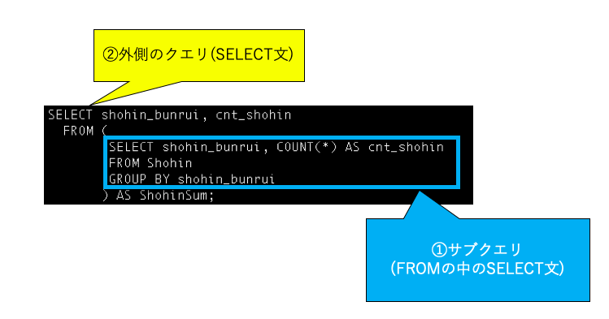

5-2 サブクエリ
============

## 学習のポイント

* サブクエリとは、一言で言うと「使い捨てのビュー(SELECT文)」

  => ビューと異なり、SELECT文の実行終了後に消去される

* サブクエリには名前をつける必要があるため、処理内容から考えて適切な名前をつける

* `スカラ・サブクエリ`とは「必ず1行1列だけの結果を返す」と言う制限をつけたサブクエリのこと


## サブクエリとビュー

* 「サブクエリ」とは、ビューを基本とした「使い捨てのビュー」

* ビューとは、データそのものを保存するのではなく、データを取り出すSELECT文だけを保存すると言う方法で、ユーザの便利性を高めていた

* サブクエリとは、「ビュー定義のSELECT文」をそのままFROM句に持ち込んだもの

* 例)ビューとサブクエリ

```sql
/* 商品分類ごとに商品数を集約するビュー */
CREATE VIEW ShohinSum (shohin_bunrui, cnt_shohin)
AS
SELECT shohin_bunrui, COUNT(*)
FROM Shohin
GROUP BY shohin_bunrui;

/* ビューが作成されていることの確認 */
SELECT shohin_bunrui, cnt_shohin
FROM ShohinSum;
```

```sql
/* サブクエリ */
SELECT shohin_bunrui, cnt_shohin
FROM (SELECT shohin_bunrui, COUNT(*) AS cnt_shohin    /* ビュー定義のSELECT文をそのまま書く */
      FROM Shohin
      GROUP BY shohin_bunrui) AS ShohinSum;
```

* これらの結果は、以下の通りになる

```sql
shohin_bunrui | cnt_shohin
---------------+------------
キッチン用品  |          4
衣服          |          2
事務用品      |          2
```

* 「ビュー定義のSELECT文」を、そのままFROM句の中に入れたものが`サブクエリ`

  => 「`AS ShohinSum`」というのが、サブクエリの名前

  => 使い捨ての名前なので、SELECT文の実行終了後には消えて無くなる

* 「サブクエリ」とは、「下位(sub)」の「問い合わせ(query)」と言う意味

  => query(クエリ)とは、SELECT文の同意語なので、「一段レベルの下のSELECT文」と言う意味を表す

* 実際には、このSELECT文は入れ子構造になっていて、

  1. FROM句の中のSELECT文が実行

  1. 外側のSELECT文が実行される

  という順番となる



  1. まずはFROM句の中のSELECT文(サブクエリ)が実行される

    ```sql
    SELECT shohin_bunrui, COUNT(*) AS cnt_shohin
    FROM Shohin
    GROUP BY shohin_bunrui;
    ```

  1. 1.の結果に対して、外側のSELECT文が実行される

    ```sql
    SELECT shohin_bunrui, cnt_shohin
    FROM ShohinSum;
    ```


### サブクエリの階層数を増やす

* サブクエリの階層数には原則的に制限はないので、サブクエリの中のFROM句にさらにサブクエリを使って表現することができる

```sql
SELECT shohin_bunrui, cnt_shohin
FROM (SELECT *
      FROM (SELECT shohin_bunrui, COUNT(*) AS cnt_shohin
            FROM Shohin
            GROUP BY shohin_bunrui) AS ShohinSum
      WHERE cnt_shohin = 4) AS ShohinSum2;
```

```sql
shohin_bunrui | cnt_shohin
---------------+------------
キッチン用品  |          4
```

* 一番内側のサブクエリ(ShohinSum)で商品分類(shohin_bunrui)ごとに集約し、その1つ外側のサブクエリで、

  商品数(cnt_shohin)が4のレコードに制限している

  => 結果は、キッチン用品の1行に絞られる

* ただし、サブクエリの階層が深くなるほどSQL文は読みにくくなるので、パフォーマンスに悪影響を及ぼす

  => なるべく階層を深くすることを避ける


## サブクエリの名前

* サブクエリの名前は、原則的に必要なものなので、処理内容から考えて適切な名前をつけるようにする

  => 名前をつける時には、`AS`キーワードを使うが、この`AS`は省略することができる


## スカラ・サブクエリ


### スカラとは

* 「スカラ」とは、「単一の」という意味の言葉で、データベース以外の分野でも使われる

* 「サブクエリ」は、基本的に複数行を結果として返す(構造的にはテーブルと同じなので)

* 「スカラ・サブクエリ」は、**必ず1行1列だけの戻り値を返す** と言う制約をつけたサブクエリのこと

  => 例)テーブルの"ある1行"の"ある1列"の値とは、"10"や"東京都"のようなただ1つの値ということ

  => 戻り値が単一の値なので、スカラ・サブクエリの戻り値を`=`、`<>`など、スカラ値を入力する比較演算子の入力として利用することができるようになる


### WHERE句でスカラ・サブクエリを使う

* 例)Shohinテーブルから、「販売単価が、全体の平均の販売単価より高い商品だけを検索する」

```sql
/* WHERE句にAVG関数を使う(エラーとなる) */
SELECT shohin_id, shohin_mei, hanbai_tanka
FROM Shohin
WHERE hanbai_tanka > AVG(hanbai_tanka);

/* エラーが発生する */
ERROR:  aggregate functions are not allowed in WHERE
LINE 3: WHERE hanbai_tanka > AVG(hanbai_tanka);       /* 「販売単価の平均より大きい」という条件？ */
```

=> このSQL文では、集約関数をWHERE句に書くことができないと言う制限のため、謝りとなる

* スカラ・サブクエリの場合は、以下のスカラ・サブクエリを用いる

```sql
SELECT AVG(hanbai_tanka)
  FROM Shohin;
```

```sql
avg          
-----------------------
2097.5000000000000000
```

  => この結果をそのまま、先ほど失敗したクエリの右辺に用いる

```sql
SELECT shohin_id, shohin_mei, hanbai_tanka
FROM Shohin
WHERE hanbai_tanka > (SELECT AVG(hanbai_tanka)  /* 平均の販売単価を求める「スカラ・サブクエリ」 */
                      FROM Shohin);
```

```sql
shohin_id |   shohin_mei   | hanbai_tanka
-----------+----------------+--------------
0003      | カッターシャツ |         4000
0004      | 包丁           |         3000
0005      | 圧力鍋         |         6800
```

* サブクエリの実行としては、以下の順番となる

  1. 内側のサブクエリが実行

    ```sql
    SELECT AVG(hanbai_tanka)
      FROM Shohin;
    ```

  1. 外側のサブクエリが実行

    ```sql
    SELECT shohin_id, shohin_mei, hanbai_tanka
    FROM Shohin
    WHERE hanbai_tanka > 2097.5;
    ```


## スカラ・サブクエリを書ける場所

* スカラ・サブクエリを書ける場所は、基本的に **スカラ値が書けるところにはどこにでも書ける。**

  => **定数や列名を書くことのできる場所全てとなる**

  => SELECT句でも、GROUP BY句でもHAVING句でもORDER BY句でも、ほとんどあらゆる場所に書くことが可能

* 例)SELECT句では、平均値が以下のように書くことができる

```sql
SELECT shohin_id,
       shohin_mei,
       hanbai_tanka,
       (SELECT AVG(hanbai_tanka)
          FROM Shohin) AS avg_tanka
  FROM Shohin;
```

```sql
shohin_id |   shohin_mei   | hanbai_tanka |       avg_tanka       
-----------+----------------+--------------+-----------------------
0001      | Tシャツ        |         1000 | 2097.5000000000000000
0002      | 穴あけパンチ   |          500 | 2097.5000000000000000
0003      | カッターシャツ |         4000 | 2097.5000000000000000
0004      | 包丁           |         3000 | 2097.5000000000000000
0005      | 圧力鍋         |         6800 | 2097.5000000000000000
0006      | フォーク       |          500 | 2097.5000000000000000
0007      | おろしがね     |          880 | 2097.5000000000000000
0008      | ボールペン     |          100 | 2097.5000000000000000
```

* HAVING句を書くならば、以下のようなSELECT文を書くことができる

```sql
SELECT shohin_bunrui, AVG(hanbai_tanka)
  FROM Shohin
GROUP BY shohin_bunrui
HAVING AVG(hanbai_tanka) > (SELECT AVG(hanbai_tanka)
                              FROM Shohin);
```

```sql
shohin_bunrui |          avg          
---------------+-----------------------
キッチン用品  | 2795.0000000000000000
衣服          | 2500.0000000000000000
```

* 意味：「商品分類(shohin_bunrui)ごとに計算した平均販売単価が、商品全体の平均販売単価より高い商品分類を選択する」


## スカラ・サブクエリを使うときの注意点

* 最も注意する点：「絶対にサブクエリが複数行を返さないようにする」こと

  => サブクエリが複数行返した場合は、ただのサブクエリとなるので、`=`、`<>`といったスカラ値が使えなくなる

```sql
/* スカラ・サブクエリではないので 、SELECT句に書けない */
SELECT shohin_id,
       shohin_mei,
       hanbai_tanka,
       (SELECT AVG(hanbai_tanka)              /* サブクエリ(始) */
          FROM Shohin
        GROUP BY shohin_bunrui) AS avg_tanka  /* サブクエリ(終)*/
  FROM Shohin;
```

```sql
ERROR:  more than one row returned by a subquery used as an expression
/* 副問い合わせで1行を超える行を返すものが式として使用されました */
```


| 版 |   年月日  |
|----|----------|
|初版|2018/12/24|
