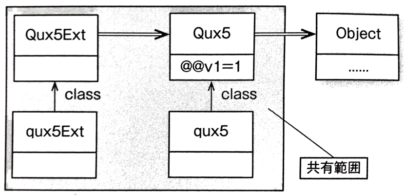

4-7.変数と定数
============

## 4-7-1.ローカル変数とグローバル変数

### ローカル変数

* 英小文字またはアンダースコア`_`で始まる変数

* トップレベルで定義された`v1`を、クラス`Qux1`の内部からは参照できない

* メソッドからは、トップレベルに加えてクラス内部、メソッドの外部で定義されたローカル変数も参照できない

  →クラス定義と内部のメソッドはそれぞれ独立したスコープを持ち、相互に参照できないため

```ruby
# トップレベルで定義したローカル変数をクラス内部で呼び出す
>> v1 = 1
=> 1
>> class Qux1
>>   p v1
>> end
NameError: undefined local variable or method 'v1' for Qux1:Class

# ローカル変数を、トップレベル・クラス内部・メソッドの外部で定義する
>> v1 = 1
=> 1
>> class Qux2
>>   v2 = 2
>>   def method1; v1; end
>>   def method2; v2; end
>> end
=> :method1
>>
>> Qux2.new.method1
NameError: undefined local variable or method 'v1' for #<Qux2:0x007f91b917b770>
>> Qux2.new.method2
NameError: undefined local variable or method 'v2' for #<Qux2:0x007f91b9162590>
```

### グローバル変数

* 変数名の頭に`$`を付けて初期化する

* プログラム中からどこでも参照することができる

```ruby
>> $v1 = 1
=> 1
>> class Qux2
>>   $v2 = 2
>>   def method1; $v1; end
>>   def method2; $v2; end
>> end
=> :method2

>> Qux2.new.method1
=> 1
>> Qux2.new.method2
=> 2
```

***

## 4-7-2.インスタンス変数

* 変数の頭に`@`を付けて初期化する

* 初期化していない場合は`nil`を返す

```ruby
>> @v1 = 1
=> 1
>> class Qux3
>>   @v2 = 2
>>   def method1; @v1; end
>>   def method2; @v2; end
>> end
=> :method2

>> Qux3.new.method1
=> nil
>> Qux3.new.method2
=> nil
```

* インスタンス変数は、インスタンスに値が格納される

* インスタンス変数はメソッドのように探索されない。そのインスタンスの中だけで完結する

* トップレベルで初期化された`@v1`は、トップレベルのObjectのインスタンスに格納される

* `@v2`は、クラスの中で値が代入されているので、Qux3クラスに格納される


### アクセッサメソッド

* インスタンス変数をインスタンス内に格納し、外部からアクセスするために必要

  →オブジェクトの外からはインスタンス変数に直接アクセスすることができないため

* インスタンスメソッドの内部で初期化する

* インスタンス変数に値を保持することで、オブジェクト固有の状態を保持することができる

```ruby
>> class Qux4
>>   def v3
>>     return @v3             # @v3に対するgetter
>>   end
>>   def v3=(value)           # @v3に対するsetter
>>     @v3 = value
>>   end
>>   def method1; @v3; end
>> end
=> :method1

>> qux4 = Qux4.new
=> #<Qux4:0x007ff5a8191e28>
>> qux4.v3 = 3
=> 3
>> p qux4.v3
3
=> 3
>> p qux4.method1
3
=> 3
```

* いちいちアクセサを定義するのは冗長なので、アクセサの定義を行うクラスメソッドが用意されている

|    種類    |                          機能                          |
|-----------|-------------------------------------------------------|
|attr_reader|getterメソッドを生成する                                  |
|attr_writer|setterメソッドを生成する                                  |
|attr_accessor|getterとsetterメソッドを生成する                        |
|attr|getterメソッドを生成する。第2引数にtrueを指定するとsetterメソッドも生成|

```ruby
>> class Qux4
>>   attr_accessor :v3
>>   def method1; @v3; end
>> end
=> :method1

>> qux4 = Qux4.new
=> #<Qux4:0x007ff5a8153ad8>
>> qux4.v3 = 3
=> 3
>> p qux4.v3         # レシーバ
3
=> 3
>> p qux4.method1    # レシーバ
3
=> 3
```

* インスタンス変数は継承されないが、メソッドは継承されるので、サブクラスからメソッドを経由して

  スーパークラスのインスタンス変数にアクセスすることが可能

```ruby
>> class Qux4Ext < Qux4
>> end
=> nil

>> qux4Ext = Qux4Ext.new
=> #<Qux4Ext:0x007ff5a81303d0>
>> qux4Ext.v3 = 4
=> 4
>> p qux4Ext.v3
4
=> 4
```

## 4-7-3.クラス変数

* インスタンス変数は、インスタンスが管理する変数なので継承されない

* クラス変数は、インスタンス間で共有され、さらに自分自身のクラスとサブクラスでも共有される

```ruby
>> class Qux5
>>   @@v1 = 1
>>   def v1; @@v1; end
>>   def v1=(value); @@v1=value; end
>> end
=> :v1=
>>
>> class Qux5Ext < Qux5
>> end
=> nil

>> qux5 = Qux5.new
=> #<Qux5:0x007ff5a8849400>
>> p qux5.v1
1
=> 1

>> qux5Ext = Qux5Ext.new
=> #<Qux5Ext:0x007ff5a8802af0>
>> p qux5Ext.v1
1
=> 1
```



* サブクラスのインスタンスや別のインスタンスから更新することもできる

```ruby
>> qux5Ext.v1 = 10
=> 10
>> qux5.v1
=> 10
>> Qux5.new.v1 = 100
=> 100
>> qux5.v1
=> 100
```

* 同名のクラス変数をサブクラスで宣言すると、実際には代入となってスーパークラスのクラス変数を書き換える

```ruby
>> class Qux6
>>   @@v1 = 1
>>   def v1; @@v1; end
>> end
=> :v1

>> class Qux6Ext < Qux6
>>   @@v1 = 2
>> end
=> 2

>> Qux6.new.v1
=> 2
```

***

## 4-7-4.ネストしたスコープの定義

### 定数の特徴

* クラス名、モジュール名は全て定数

* 大文字から始まる名前を指定して初期化し、再代入しようとするとエラーが発生

  →警告が出ても実際は値が更新される

* 定数はメソッドの中で定義することができない

  →メソッドは複数回の実行が前提なので、定数の初期化、値の更新を許さない

```ruby
# 定数の再代入
>> A = 1
=> 1
>> p A
1
=> 1
>> A = 2
(irb):3: warning: already initialized constant A
(irb):1: warning: previous definition of A was here
=> 2
>> p A
2
=> 2

# メソッド定義内の定数宣言
>> def func
>>  B = 2
>> end
SyntaxError: (irb):6: dynamic constant assignment
```

***

### 定数のパス

* 定数は、ファイルシステムのようにツリー状に配置されている

  * モジュール・クラス：ディレクトリ

  * 定数：ファイル

  →ディレクトリが違えば、同じ名前のファイルを複数持つことができる

* ファイルのように定数もパスで表すことができる


```ruby
>> module M
>>   class C
>>     X = 'ある定数'
>>   end
>> end
=> "ある定数"

>> p M::C::X
"ある定数"
=> "ある定数"

# ネストした定数の定義
>> M::C::Y = 1          # Cクラスに、定数Yを定義
=> 1
>> M::C::Y::D = 1       # 定数Yは整数オブジェクトなので、定義に失敗
TypeError: 1 is not a class/module
```

* 定数ツリーの奥の方にいるときは、ルートを示すコロン2つ`::`で書き始めれば、外部の定数を絶対パスで指定できる

```ruby
>> X = 'ルートレベルの定数'
=> "ルートレベルの定数"

>> module M
>>   X = 'Mにある定数'
>>   class Y
>>     Z = 1
>>   end
>>   p X
>>   p ::X
>>   p ::M::X
>>   p ::M::Y::Z
>> end
"Mにある定数"         # p X
"ルートレベルの定数"   # p ::X
"Mにある定数"         # p ::M::X
1                   # p ::M::Y::Z
```

***

## 4-7-5.ネストしたスコープの参照

* `Module#constans`：外部から参照可能な定数(線で繋がっている定数)を調べる

  * インスタンスメソッド：レシーバ(またはそのスーパークラスやインクルードしているモジュール)に定義されている定数の名前を配列で返す

  * クラスメソッド：現在のトップレベル定数を返す(クラス名も含まれる)

```ruby
>> module M
>>   A = 1
>>   class B
>>     A = 2
>>   end
>>   class C
>>   end
>> end
=> nil

# Module#constansメソッド(インスタンスメソッド)
>> M.constants
=> [:A, :B, :C]
>> M::B.constants
=> [:A]
>> M::C.constants
=> []

# クラスメソッド
>> Module.constants.include? :Object
=> true
>> Module.constants.include? :Module
=> true
```

* `Module#nesting`：パスが必要な場合に使用

```ruby
>> module M
>>   class C
>>     module M2
>>       Module.nesting
>>     end
>>   end
>> end
=> [M::C::M2, M::C, M]
```

### 指定した定数が見つからない場合の動き

* 繋がっていないものが指定された場合、インタプリタはネストしたクラスやモジュールを探す

  →ネストの外側のクラスやモジュールの定数を内側から外側に向かって順に探す

```ruby
>> module M
>>   A = 1     # 参照される定数A
>>   class B
>>     A = 2
>>   end
>>   class C
>>     p A     # Cクラスの中で定数Aを参照すると、C以下には存在しない
>>   end
>> end
1              # Cの外側のモジュールM内に存在する定数Aが参照される
=> 1
```

* 外側のモジュールにも存在しない場合、さらに外側のモジュールやクラスの継承チェーンをたどる

```ruby
>> class Foo
>>   A = 1
>> end
=> 1

?> module Bar
>>   B = 2
>> end
=> 2

?> class FooExt < Foo
>>   include Bar
>>   p A                 # 親クラスで宣言された定数を参照
>>   p B                 # モジュールで宣言された定数を参照
>> end
1
2
=> 2
```

* スーパークラスにも定数が見つからない場合、インタプリタは自分自身のクラスメソッド`const_missing`を呼び出す。

* `const_missing`のデフォルトで、例外`NameError`を発生する

* このメソッドを上書きすることで、定数が見つからない場合の動作を制御できる

```ruby
>> module M
>>   def self.const_missing(id)
>>     1
>>   end
>> end
=> :const_missing

>> M::HOGE      # const_missingの呼び出し
=> 1
```

| 版 |   年月日  |
|----|----------|
|初版|2018/10/13|
