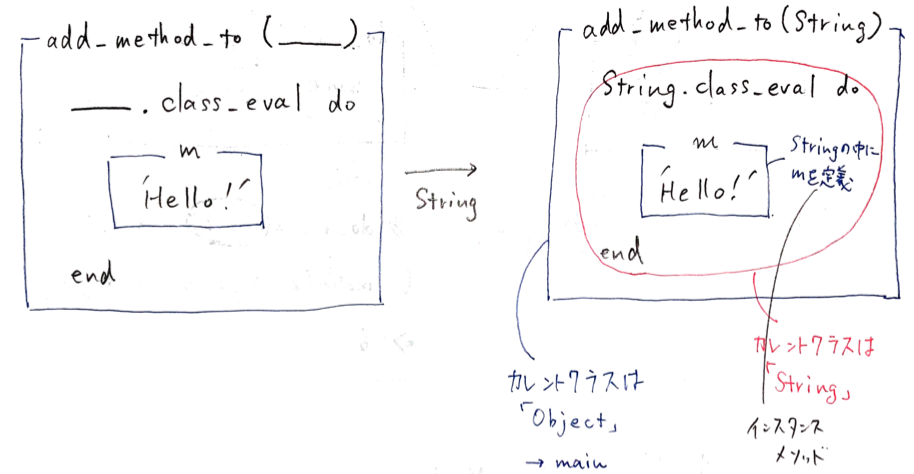

# クラス定義

* Rubyにおける「クラス定義」は、 **実際にコードを実行している**

* 「クラス定義」は、高性能な **モジュール**

  →クラスについて学んだことは、モジュールにも適用できる

## クラス定義のわかりやすい定義

### クラス定義の中身

* クラスを定義するには、以下の`class文`を使う

```ruby
class クラス名
  クラスの定義
end
```

* クラス(モジュール)定義の中では、クラスがカレントオブジェクト`self`になる・・・オブジェクトのため

```ruby
# クラス定義1
>> class MyClass
>>   puts 'Hello!'
>> end
Hello!
=> nil

# クラス定義2
>> result = class MyClass
>>            self
>>          end
=> MyClass
```

***

### カレントクラス

* Rubyのプログラムでは、常に **カレントオブジェクト`self`** を持っている

  →同様に、クラスやモジュールについても **カレントクラス(モジュール)** を持っている

* メソッドを定義すると、 **カレントクラス** の **インスタンスメソッド** になる

* **カレントオブジェクト** は`self`で参照を獲得できるが、 **カレントクラス** を参照するキーワードは無い

  →コードを見ることで **カレントクラス** を追跡することができる


#### コードを見ることで「カレントクラス」を追跡する方法

* プログラムのトップレベルでは、カレントクラスは`main`のクラスの`Object`になる

  →`irb`などで直接メソッドを定義すると、`Object`の **インスタンスメソッド** になる

* `class`定義でクラスをオープンすると、そのクラスが **カレントクラス** になる

* **メソッド** の中では、 **カレントオブジェクト** のクラスが **カレントクラス** になる

```ruby
>> class C
>>   def m1
>>     def m2; end
>>   end
>> end
=> :m1

>> class D < C; end
=> nil

>> obj = D.new
=> #<D:0x007fbfef035528>
>> obj.m1
=> :m2

>> C.instance_methods(false)
=> [:m1, :m2]
```

#### `class_eval`

* クラス名がわからない時に、クラスをオープンために使う

* カレントクラスを変更することもできる

* `Module#class_eval`は、そこにあるクラスのコンテキストでブロックを評価するもの

```ruby
>> def add_method_to(a_class)
>>   a_class.class_eval do
>>     def m; 'Hello!'; end
>>   end
>> end
=> :add_method_to

>> add_method_to String
=> :m
>> "abc".m
=> "Hello!"
```



* `instance_eval`では、`self`を変更することでスコープ内に入る

* `class_eval`では、`self`と`カレントクラス`を変更することでスコープ内に入る

* `class`が定数を必要とすることに対して、`class_eval`は **クラスを参照している変数** なら何でも使える

* `class`は現在の束縛を捨てて、新しいスコープをオープンするのに対し、`class_eval`はフラットスコープ(２つのスコープを一緒の場所に押し込めて、

  変数を共有する)を持っている

  →`class_eval`ブロックのスコープの外側にある変数も参照できる

#### `instance_eval`と`class_eval`の使い分け

* `instance_eval`：クラス以外のオブジェクトをオープンしたい場合

* `class_eval`：クラス定義をオープンして、defを使ってメソッドを定義したい場合

* `self`の変更：両方使えるが、意図がうまく伝わる方を使う

  * `instance_eval`：「このオブジェクトをオープンしたいが、クラスのことは気にしない」

  * `class_eval`：「ここでオープンクラスを使いたい」

#### カレントクラスのまとめ

* Rubyのインタプリタは、常に **カレントクラス** の参照を追跡している

* defで定義された全てのメソッドは、 **カレントクラスのインスタンスメソッド** になる

* クラス定義の中では、 **カレントオブジェクト`self`** と **カレントクラス(定義しているクラス)** は同じである

* クラスへの参照を持っていれば、クラスは`class_eval`でオープンできる

***

### クラスインスタンス変数

* Rubyインタプリタは、全ての **インスタンス変数** は **カレントオブジェクト`self`** に属している

  →クラス定義でも同じ。`self`はクラス定義のこと

* インスタンス変数`@my_var`はクラスに属していることになる。

  →クラスのインスタンス変数と、クラスの **オブジェクト** のインスタンス変数は別物

```ruby
>> class MyClass
>>   @my_var = 1
>>   def self.read; @my_var; end     # クラスメソッド
>>   def write; @my_var = 2; end     # インスタンスメソッド
>>   def read; @my_var; end          # インスタンスメソッド
>> end
=> :read

>> obj = MyClass.new
=> #<MyClass:0x007fea1f253558>
>> obj.read                          # この時点では、クラスのオブジェクトのインスタンス変数にはまだ代入されいない
=> nil
>> obj.write                         # クラスのオブジェクトのインスタンス変数に代入(@my_var = 2)
=> 2
>> obj.read                          # クラスのオブジェクトのインスタンス変数に代入(@my_var(2))
=> 2
>> MyClass.read                      # クラスのインスタンス変数は、すでに@my_var = 1が定義されている
=> 1
```

#### クラス変数

* `@@`：クラス変数。クラスインスタンス変数とは異なる

* クラス変数は、サブクラスや通常のインスタンスメソッドからもアクセスできる

  →クラスに変数を保存する役割は果たすが、クラスインスタンスメソッドよりも広義

```ruby
>> class C
>>   @@v = 1
>> end
=> 1

>> class D < C
>>   def my_method; @@v; end
>> end
=> :my_method

>> D.new.my_method
=> 1
```

* クラス変数は、「クラス階層」に属している。`main`クラスである`Object`とその子孫に属している

  `MyClass`では、`Object`クラスを継承しているので、同じクラス変数を共有することになる

* トップレベルでクラス変数にアクセスすると警告が表示される

```ruby
>> @@v = 1
(irb):21: warning: class variable access from toplevel
=> 1

>> class MyClass
>>   @@v = 2
>> end
=> 2

>> @@v
(irb):26: warning: class variable access from toplevel
=> 2
```


### リファクタリング

> 2018/10/10
> のちにやる
> →同様に、5.2も

## 特異メソッド

`Paragraph`クラスは、文字列をラップしたクラスである。

全ての呼び出しは文字列に委譲しているが、`Paragraph#title?`だけは委譲せずに文字列が全て大文字のときに`true`を戻すようにしている

`Paragraph`オブジェクトは、`Bookwork`のある特定の場所で生成しており、`title?`メソッドは、アプリケーション全体の`index`メソッドで使われている

問題点としては、`Paragraph`クラスは中身がないこと。

対処法は、

* `String`クラスにモンキーパッチ

* `Refinements`を使って、`String`クラスにパッチを当てる

* **特異メソッド** を使用(今回)

```ruby
class Paragraph
  def initialize(text)
    @text = text
  end

  def title?; @test.upcase == @text; end
  def reverse; @test.reverse; end
  def upcase; @test.upcase; end
  # 省略
end


# アプリケーションで1回のみ使われる
def index(paragraph)
  add_to_index(paragraph) if paragraph.title?
end
```

### 特異メソッドの導入

* Rubyでは、特定のオブジェクトにメソッドを追加できる

* 単一のオブジェクトに特化したメソッドのことを、 **特異メソッド** という

* 特異メソッドは、以下の構文or`Object#define_singleton_method`で定義することができる

```ruby
>> str = "just a regular string"
=> "just a regular string"

>> def str.title?
>>   self.upcase == self
>> end
=> :title?

>> str.title?
=> false
>> str.methods.grep(/title?/)
=> [:title?]
>> str.singleton_methods
=> [:title?]
```

#### ダックタイピング

Rubyでは、オブジェクトの「型」は、そのクラスとは厳密には結びついておらず、

「型」はオブジェクトが反応するメソッドの集合にすぎない

このような流動的な型のことを、`ダックタイピング`という

→「アヒルのように歩いて、アヒルのように泣けば、それはアヒルに違いない」という話に由来

→あるオブジェクトが`Duck`クラスのインスタンスかどうかを気にする必要がない

### クラスメソッドの真実

* クラスは単なるオブジェクトであり、クラス名は単なる定数

* `an_object.a_method`：変数で参照したオブジェクトのメソッドを呼び出している

* `AClass.a_class_method`：定数で参照したオブジェクト(これがクラス)のメソッドを呼び出している

  →これらより、クラスメソッドは **クラスの特異メソッド** である。

```ruby
def obj.a_singleton_method; end          # 特異メソッドの定義
def MyClass.another_class_method; end    # クラスメソッドの定義
```

* 特異メソッドを`def`を使って定義する構文

* `object`の部分には、

  * オブジェクトの参照

  * クラス名の定数

  * `self`

```ruby
def object.method
  # メソッドの中身
end
```

### クラスマクロ

#### `attr_accessor`の例

* Rubyオブジェクトには、アトリビュート(プロパティ)がない

* アトリビュートのようなものが欲しい時は、 **読み込み用** と **書き込み用** の2つのミミックメソッドを定義する

※アトリビュートが必要な理由

クラスの中で使われているインスタンス変数は、クラスの外側から参照したり、値を変更できないので、これを定義できるようにする

```ruby
>> class MyClass
>>   def my_attribute=(value)
>>     @my_attribute = value
>>   end
>>
>>   def my_attribute
>>     @my_attribute
>>   end
>> end
=> :my_attribute

>> obj = MyClass.new
=> #<MyClass:0x007fad49071838>
>> obj.my_attribute = 'x'
=> "x"
>> obj.my_attribute
=> "x"
```

* このようなメソッド(アクセサ)は、`Module#attr*`を用いる

  * `attr_reader`：読み取り用を生成する

  * `attr_writer`：書き込み用を生成する

  * `attr_accessor`：読み書き両用を生成する

```ruby
# 先ほどのコートのリファクタリング
>> class MyClass
>>   attr_accessor :my_attribute
>> end
=> nil

>> obj = MyClass.new
=> #<MyClass:0x007ffbb500fc18>
>> obj.my_attribute = 'x'
=> "x"
>> obj.my_attribute
=> "x"
```

* `attr_*`族のメソッドは、`Module`クラスで定義されているので、`self`がモジュールでもクラスでも使用可能

* `attr_accessor`のようなメソッドを、 **クラスマクロ** と呼ぶ

* クラスマクロはキーワードのように思われるが、クラス定義の中で使える単なるクラスメソッドである

#### クラスマクロの適用

> 2018/10/10
> `deprecate`メソッドが何かを調べる

***

## 特異クラス
