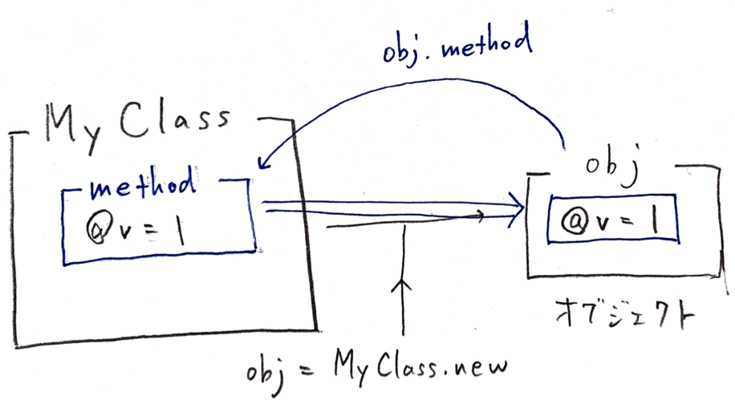

# 動的メソッド

* メソッドを呼び出す・・・オブジェクトにメッセージを送っている



## メソッドを動的に呼び出す

* メソッドを呼び出すには、2通りの方法がある

  1. ドット記法`.`を使う(通常)

  2. `Object#send`を使う

```ruby
>> class MyClass
>>   def my_method(my_arg)
>>     my_arg * 2
>>   end
>> end
=> :my_method

# 1. ドット記法`.`を使う
>> obj = MyClass.new
=> #<MyClass:0x007f848e006a08>
>> obj.my_method(3)
=> 6

# 2. `Object#send`を使う
>> obj.send(:my_method, 3)
=> 6
```

#### `send`の活用

* 第一引数は、オブジェクトに送信するメッセージ(メソッド名：シンボル)

* 第二引数以降は、そのままオブジェクトに送信される

* 呼び出したいメソッド名が通常の引数になり、コードの **実行時** に呼び出すメソッドを決めることができる

  → **動的ディスパッチ**

* `private`メソッドも呼び出すことができるので、セキュリティには注意しなければならない

  →`public_send`メソッドは、レシーバのプライバシーに配慮しているが、`send`の方がよく使う

***

## メソッドを動的に定義する

* `Module#define_method`：メソッドをその場で定義できる。メソッド名とブロックを渡す必要があり、ブロックがメソッドの本体になる

```ruby
>> class MyClass
>>   define_method :my_method do |my_arg|
>>     my_arg * 3
>>   end
>> end
=> :my_method

>> obj = MyClass.new
=> #<MyClass:0x007fdb01010728>
>> obj.my_method(2)
=> 6
```

* `define_method`は、`MyClass`の中で実行されている

  →`my_method`は、`MyClass`のインスタンスメソッドとして定義される(実行時にメソッドを定義するこの技法を、 **動的メソッド** と言う)

***

## `Computer`クラスのリファクタリング

### 元のコード

```ruby
class DS
  def initialize; end  # データソースに接続・・・
  def get_cpu_info(workstation_id); end
  def get_cpu_price(workstation_id); end
  def get_mouse_info(workstation_id); end
  # 省略
end
```

```ruby
class Computer
  def initialize(computer_id, data_source)
    @id = computer_id
    @data_source = data_source
  end

  def mouse
    info = @data_source.get_mouse_info(@id)
    price = @data_source.get_mouse_info(@id)
    result = "Mouse: #{info} ($#{price})"
    return "* #{result}" if price >= 100
    result
  end

  def cpu
    info = @data_source.get_cpu_info(@id)
    price = @data_source.get_cpu_info(@id)
    result = "Cpu: #{info} ($#{price})"
    return "* #{result}" if price >= 100
    result
  end
  # 省略
end
```

### 1.動的ディスパッチを追加する

```ruby
class Computer
  def initialize(computer_id, data_source)
    @id = computer_id
    @data_source = data_source
  end

  def mouse
    component :mouse   # componentメソッドに、メソッド名(:mouse)を移譲
  end

  def cpu
    component :cpu
  end

  def component(name)
    info = @data_source.send "get_#{name}_info", @id
    price = @data_source.send "get_#{name}_price", @id
    result = "#{name.capitalize}: #{info} ($#{price})"
    return "* #{result}" if price >= 100
    result
  end
end
```

* `mouse`の呼び出しは`component`に移譲され、そこから`DS#get_mouse_info`、`DS#get_mouse_price`が呼び出される

* さらに、コンポーネントの名前を大文字にして、結果の文字列に書き込んでいる

***

### 2.メソッドを動的に生成する

```ruby
class Computer
  def initialize(computer_id, data_source)
    @id = computer_id
    @data_source = data_source
  end

  def self.define_component(name)   # クラスメソッド
    define_method(name) do
      info = @data_source.send "get_#{name}_info", @id
      price = @data_source.send "get_#{name}_price", @id
      result = "#{name.capitalize}: #{info} ($#{price})"
      return "* #{result}" if price >= 100
      result
    end
  end

  define_component :mouse
  define_component :cpu
end
```

* `define_method`が2回呼び出され、`Computer`クラスが暗黙的に`self`になっている(クラスメソッド)

***

### 3.コードにイントロスペクションをかける

* `define_component`メソッドの呼び出しをなくすことでコードの排除を目指す

* 引数の`data_source`をイントロスペクションして、コンポーネントの名前に展開する

```ruby
class Computer
  def initialize(computer_id, data_source)
    @id = computer_id
    @data_source = data_source
    data_source.methods.grep(/^get_(.*)_info$/) {Computer.define_component $1}
  end

  def self.define_component(name)
    define_method(name) do
      info = @data_source.send "get_#{name}_info", @id
      price = @data_source.send "get_#{name}_price", @id
      result = "#{name.capitalize}: #{info} ($#{price})"
      return "* #{result}" if price >= 100
      result
    end
  end
end
```

* `initialize`では、

  * `Array#grep`にブロックを渡すと、正規表現にマッチした要素全てに対してブロックが評価される

  * 正規表現にマッチした文字列は、グローバル変数`$1`に格納される

  →`data_source`が、`get_cpu_info`と`get_mouse_info`の2つのメソッドを持っていれば、`Computer.define_component`を2回呼び出す

***

# `method_missing`

* Rubyには、メソッド呼び出しを制限するコンパイラが存在しないので、存在しないメソッドも呼び出せる

```ruby
>> class Lawyer; end
=> nil
>> nick = Lawyer.new
=> #<Lawyer:0x007fdaff9857b0>
>> nick.talk_simple
NoMethodError: undefined method `talk_simple` for #<Lawyer:0x007fdaff9857b0>
```

* `talk_simple`を呼び出すと、Rubyはnickのクラスをのぞいて、インスタンスメソッドを閲覧する

* そこで`talk_simple`が見つからなければ、継承チェーンを上って調査する

* `BasicObject`まで上っても見つからない場合は、元のレシーバである`nick`の`method_missing`を呼び出して、負けを認める

* `method_missing`は、`BasicObject`の`private`インスタンスメソッド

***

* `send`を用いることで、`method_missing`を自分自身で呼び出すことができる

```ruby
>> nick.send :method_missing, :my_method
NoMethodError: undefined method `my_method' for #<Lawyer:0x007fdaff9857b0>
```

***

## `method_missing`のオーバーライド

* `method_missing`をオーバーライドして、不明なメッセージを途中で捕まえることができる

* `method_missing`の受付までたどり着いたメッセージは、 **呼び出されたメソッドの名前を持っている**

```ruby
>> class Lawyer
>>   def method_missing(method, *args)
>>     puts "呼び出した:#{method}(#{args.join(', ')})"
>>     puts "(ブロックも渡した)" if block_given?
>>   end
>> end
=> :method_missing

>> bob = Lawyer.new
=> #<Lawyer:0x007fa29b0ea0e8>
>> bob.talk_simple('a', 'b') do
>>   # ブロック
>> end
呼び出した:talk_simple(a, b)
(ブロックも渡した)
=> nil
```

***

## ゴーストメソッド

* `method_missing`で処理されたメッセージは、

  * 呼び出し側：通常の呼び出し

  * レシーバ側：対応するメソッドが見つからない(ゴーストメソッド)

***

## `Computer`クラスのリファクタリング

### 元のコード

```ruby
class DS
  def initialize; end  # データソースに接続・・・
  def get_cpu_info(workstation_id); end
  def get_cpu_price(workstation_id); end
  def get_mouse_info(workstation_id); end
  # 省略
end
```

```ruby
class Computer
  def initialize(computer_id, data_source)
    @id = computer_id
    @data_source = data_source
  end

  def mouse
    info = @data_source.get_mouse_info(@id)
    price = @data_source.get_mouse_info(@id)
    result = "Mouse: #{info} ($#{price})"
    return "* #{result}" if price >= 100
    result
  end

  def cpu
    info = @data_source.get_cpu_info(@id)
    price = @data_source.get_cpu_info(@id)
    result = "Cpu: #{info} ($#{price})"
    return "* #{result}" if price >= 100
    result
  end
  # 省略
end
```

### 1.`Computer`クラスの動的プロキシ化

* `method_missing`をオーバーライドして、`Computer`クラスから全ての重複を排除する

```ruby
class Computer
  def initialize(computer_id, data_source)
    @id = computer_id
    @data_source = data_source
  end

  def method_missing
    super if !@data_source.respond_to?("get_#{name}_info")
    info = @data_source.send "get_#{name}_info", @id
    price = @data_source.send "get_#{name}_price", @id
    result = "#{name.capitalize}: #{info} ($#{price})"
    return "* #{result}" if price >= 100
    result
  end
end
```

#### 動作の例

* `Computer#mouse`などのメソッドを呼び出すと、

  1. 呼び出しは全て`method_missing`に集められる

  2. データソースが`get_mouse_info`を持っているか確認する

  3. 持っていなければ、`BasicObject#method_missing`が呼び出され、そこで`NoMethodError`が発生する

  4. 持っていれば、元の呼び出し結果は

    * `DS#get_mouse_info`

    * `DS#get_mouse_price`

    の２つの呼び出しに変換される

### 2.`respond_to?`の修正

* `Computer`クラスにゴーストメソッドに反応するか質問すると、嘘が返ってくる

```ruby
cmp = Computer.new(o, DS.new)
dmp.respond_to?(:mouse)
=>false
```

* `respond_to?`にゴーストメソッドを認識させる

  →`respond_to_missing?`：`respond_to?`が呼び出す。メソッドがゴーストメソッドの時に、`true`を返す

  →`method_missing`をオーバーライドした時に、`respond_to_missing?`もオーバーライドする

```ruby
class Computer
  def initialize(computer_id, data_source)
    @id = computer_id
    @data_source = data_source
  end

  def method_missing
    super if !@data_source.respond_to?("get_#{name}_info")
    info = @data_source.send "get_#{name}_info", @id
    price = @data_source.send "get_#{name}_price", @id
    result = "#{name.capitalize}: #{info} ($#{price})"
    return "* #{result}" if price >= 100
    result
  end

  def respond_to_missing(method, include_private = false)
    @data_source.respond_to?("get_#{name}_info") || super
  end
end
```

#### 解説

* ゴーストメソッドがあれば、`true`を返す

* ゴーストメソッドがなければ、`super`を呼び出す(常に`false`)

```ruby
cmp = Computer.new(o, DS.new)
dmp.respond_to?(:mouse)
=>true
```

* `method_missing`をオーバーライドするときは、忘れずに`respond_to_missing?`もオーバーライドする

### `method_missing`の罠

```ruby
class Roullete
  def method_missing(name, *args)
    person = name.to_s.capitalize
    3.times do
      number = rand(10) + 1
      puts "#{number}..."
    end
    "#{person} got a #{number}"
  end
end

number_of = Roullete.new
puts number_of.bob
puts number_of.frank
```

#### 期待する結果と実際の結果

* 期待する結果

```ruby
5...
6...
10...
Bob got a 3
7...
```

* 実際の結果

```ruby
5...
6...
10...
4...
9...
1...
=>SystemStackError: stack level too deep
```

* 変数`number`が、(`times`を渡している)ブロックの中で定義されていて、最終行の実行時にRubyは`number`が変数だとは気がつかず、`self`に対するかっこ`()`のないメソッド呼び出しだと思っている

* 通常は、明示的に`NoMethodError`が発生するが、`method_missing`を自分で定義して、その中で`number`を呼び出している

* 同じイベントチェーンが(何度も何度も)繰り返しが起き、スタックオーバーフローが発生する

#### 解決方法

* 必要のないゴーストメソッドを導入しない

* Flankのチームメンバーの名前だけを受け付けるようにする

* 扱えない呼び出しを受け取った時に、`BasicObject#method_missing`を呼び出す

```ruby
class Roullete
  def method_missing(name, *args)
    person = name.to_s.capitalize
    super unless %w[Bob Frank Bill].include? person
    number = 0
    3.times do
      number = rand(10) + 1
      puts "#{number}..."
    end
    "#{person} got a #{number}"
  end
end

number_of = Roullete.new
puts number_of.bob
puts number_of.frank
```

***

## ブランクスレート

* `Object`を継承しているクラスでは、ゴーストメソッドの名前と継承した本物のメソッドの名が衝突すると、後者が勝ってしまう

* 最小限のメソッドしかない状態のクラス(ブランクスレート)にすることで、問題は解決する

* `Computer`クラスでは、`Computer#display`のみが`nil`を返すが、`Object`クラスに`display`メソッドが存在するため

```ruby
>> Object.instance_methods.grep /^d/
=> [:define_singleton_method, :display, :dup]
```

### `BasicObject`

```ruby
>> im = BasicObject.instance_methods
=> [:!, :==, :!=, :__send__, :equal?, :instance_eval, :instance_exec, :__id__]
```

* ブランクスレートが必要ならば、`BasicObject`を継承することで解決する

```ruby
class Computer < BasicObject
  def initialize(computer_id, data_source)
    @id = computer_id
    @data_source = data_source
  end

  def method_missing
    super if !@data_source.respond_to?("get_#{name}_info")
    info = @data_source.send "get_#{name}_info", @id
    price = @data_source.send "get_#{name}_price", @id
    result = "#{name.capitalize}: #{info} ($#{price})"
    return "* #{result}" if price >= 100
    result
  end

  def respond_to_missing(method, include_private = false)
    @data_source.respond_to?("get_#{name}_info") || super
  end
end
```

***

### `const_missing`

* 存在しない定数を参照すると、Rubyは定数の名前を`const_missing`にシンボルとして渡す

* クラス名は定数なので、`Module#const_missing`に渡される
