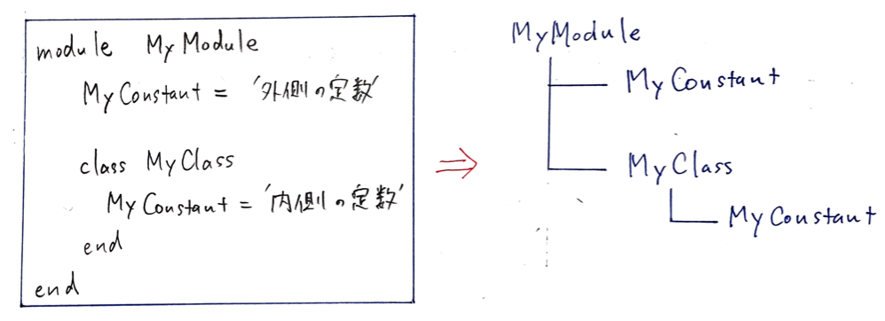

# 4-7.変数と定数

## 4-7-4.ネストしたスコープの定義

### 定数の特徴

* クラス名、モジュール名は全て定数

* 大文字から始まる名前を指定して初期化し、再代入しようとするとエラーが発生

  →警告が出ても実際は値が更新される

* 定数はメソッドの中で定義することができない

  →メソッドは複数回の実行が前提なので、定数の初期化、値の更新を許さない

```ruby
# 定数の再代入
>> A = 1
=> 1
>> p A
1
=> 1
>> A = 2
(irb):3: warning: already initialized constant A
(irb):1: warning: previous definition of A was here
=> 2
>> p A
2
=> 2

# メソッド定義内の定数宣言
>> def func
>>  B = 2
>> end
SyntaxError: (irb):6: dynamic constant assignment
```

***

### 定数のパス

* 定数は、ファイルシステムのようにツリー状に配置されている

  * モジュール・クラス：ディレクトリ

  * 定数：ファイル

  →ディレクトリが違えば、同じ名前のファイルを複数持つことができる

* ファイルのように定数もパスで表すことができる



```ruby
>> module M
>>   class C
>>     X = 'ある定数'
>>   end
>> end
=> "ある定数"

>> p M::C::X
"ある定数"
=> "ある定数"

# ネストした定数の定義
>> M::C::Y = 1          # Cクラスに、定数Yを定義
=> 1
>> M::C::Y::D = 1       # 定数Yは整数オブジェクトなので、定義に失敗
TypeError: 1 is not a class/module
```

* 定数ツリーの奥の方にいるときは、ルートを示すコロン2つ`::`で書き始めれば、外部の定数を絶対パスで指定できる

  →よくわからないので、飛ばす(2018/10/6)

```ruby
>> X = 'ルートレベルの定数'
=> "ルートレベルの定数"

>> module M
>>   X = 'Mにある定数'
>>   class Y
>>     Z = 1
>>   end
>>   p X
>>   p ::X
>>   p ::M::X
>>   p ::M::Y::Z
>> end
"Mにある定数"         # p X
"ルートレベルの定数"   # p ::X
"Mにある定数"         # p ::M::X
1                   # p ::M::Y::Z
```

***

## 4-7-5.ネストしたスコープの参照

* `Module#constans`：外部から参照可能な定数(線で繋がっている定数)を調べる

  * インスタンスメソッド：レシーバ(またはそのスーパークラスやインクルードしているモジュール)に定義されている定数の名前を配列で返す

  * クラスメソッド：現在のトップレベル定数を返す(クラス名も含まれる)

```ruby
>> module M
>>   A = 1
>>   class B
>>     A = 2
>>   end
>>   class C
>>   end
>> end
=> nil

# Module#constansメソッド(インスタンスメソッド)
>> M.constants
=> [:A, :B, :C]
>> M::B.constants
=> [:A]
>> M::C.constants
=> []

# クラスメソッド
>> Module.constants.include? :Object
=> true
>> Module.constants.include? :Module
=> true
```

* `Module#nesting`：パスが必要な場合に使用

```ruby
>> module M
>>   class C
>>     module M2
>>       Module.nesting
>>     end
>>   end
>> end
=> [M::C::M2, M::C, M]
```

### 指定した定数が見つからない場合の動き

* 繋がっていないものが指定された場合、インタプリタはネストしたクラスやモジュールを探す

  →ネストの外側のクラスやモジュールの定数を内側から外側に向かって順に探す

```ruby
>> module M
>>   A = 1     # 参照される定数A
>>   class B
>>     A = 2
>>   end
>>   class C
>>     p A     # Cクラスの中で定数Aを参照すると、C以下には存在しない
>>   end
>> end
1              # Cの外側のモジュールM内に存在する定数Aが参照される
=> 1
```

* 外側のモジュールにも存在しない場合、さらに外側のモジュールやクラスの継承チェーンをたどる

```ruby
>> class Foo
>>   A = 1
>> end
=> 1

?> module Bar
>>   B = 2
>> end
=> 2

?> class FooExt < Foo
>>   include Bar
>>   p A                 # 親クラスで宣言された定数を参照
>>   p B                 # モジュールで宣言された定数を参照
>> end
1
2
=> 2
```

* スーパークラスにも定数が見つからない場合、インタプリタは自分自身のクラスメソッド`const_missing`を呼び出す。

* `const_missing`のデフォルトで、例外`NameError`を発生する

* このメソッドを上書きすることで、定数が見つからない場合の動作を制御できる

```ruby
>> module M
>>   def self.const_missing(id)
>>     1
>>   end
>> end
=> :const_missing

>> M::HOGE      # const_missingの呼び出し
=> 1
```

|版|年月日|
|----|----|
|初版|2018/10/|
